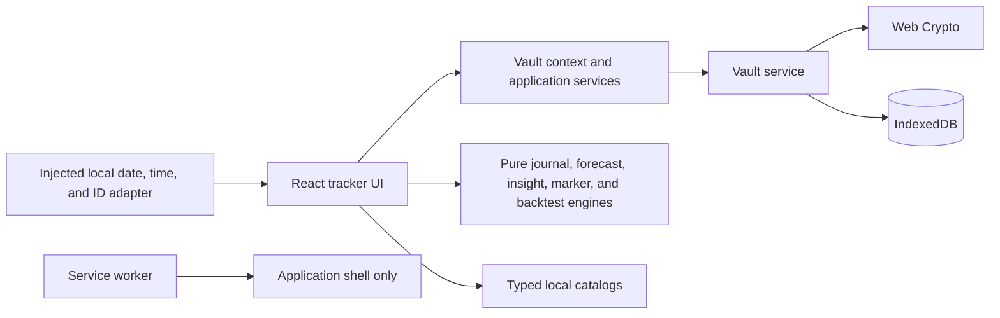

# Menstrual Pattern Tracker

> Working repository name: `perfectdays`. The final public product name is still open.

A private, mobile-first menstrual journal that records bleeding and helps its user notice her own recurring wellbeing patterns. The product uses red, orange, and green calendar markers, but treats them as personal context rather than biological verdicts or judgments about competence.

**Status:** Phase 5 mobile engineering is implemented. First use now opens a focused, skippable six-screen onboarding flow with a placeholder brand splash and language selector, dot progress, privacy introduction, optional history and estimates, pre-period window configuration, and optional PIN setup. After onboarding or unlock, the app opens a compact Calendar-first shell with separate Calendar, Privacy, and Settings destinations; a persistent one-tap today check-in action; an atomic **Save and done** flow; contextual Insights and Periods history screens; and mobile-browser coverage. Manual contrast, software-keyboard, forced-colors, screen-reader, and real-user usability review remain open, as do episode splitting/merging, evidence-driven forecast calibration, final naming, and public-beta clinical, legal, and independent security review.

Store packaging, submission requirements, and release-readiness planning are tracked in [DISTRIBUTION.md](DISTRIBUTION.md).

## Product goal

The app should make it easy to:

- record menstruation and spotting;
- estimate the next period without pretending the estimate is certain;
- add a configurable possible pre-period window;
- record daily confidence and energy, with the MVP's green marker tied specifically to recorded confidence;
- understand patterns retrospectively over several cycles; and
- keep this sensitive information private and under the user's control.

The primary user is the person who menstruates. She owns the data and decides whether it is ever exported or shared. Partner monitoring, surveillance, or automatic partner access is outside the MVP.

The product promise is **“patterns, not prescriptions.”** It must not tell someone that she is incapable of making decisions, likely to cause conflict, or guaranteed to feel a certain way because of a predicted cycle phase.

## Product principles

1. **Personal before universal.** Orange and green reflect the user's settings and observations, not assumptions about every woman.
2. **Recorded before predicted.** Logged information is visually and semantically distinct from forecasts.
3. **Uncertainty is visible.** Forecasts show a range, confidence, and the amount of history used.
4. **Colors are context, not grades.** Red is not “bad,” green is not “good,” and neutral days are valid.
5. **Privacy is architecture.** The MVP has no account, backend, advertising, analytics, or third-party tracking.
6. **The user remains in charge.** Suggestions invite a check-in; they do not direct behavior.
7. **Accessibility is part of the MVP.** Color is never the only way information is communicated.
8. **Every message is translatable.** User-visible copy, accessible names, errors, empty states, confirmations, and notification text come from keyed per-language resources rather than being embedded in components.
9. **Frequent actions stay close.** The calendar and today's check-in take priority over retrospective analysis and administrative controls.

## Calendar markers

Markers may overlap. For example, a person can be menstruating and also report high confidence. The Phase 5 mobile calendar implements the following presentation while preserving the existing meanings and precedence.

| Marker | Meaning | Mobile presentation |
| --- | --- | --- |
| **Recorded red** | Bleeding explicitly logged by the user | Solid red band joined within each calendar row, with rounded range ends, plus droplet icon and text label |
| **Predicted red** | Estimated future menstruation | Pale striped red band joined within each calendar row and clearly labeled “predicted” |
| **Orange** | Optional possible pre-period window | Striped golden background, never a warning about competence |
| **Green** | A day with an explicitly logged high-confidence score | Green badge or accent; retrospective only in the MVP |
| **Today** | The current local date | Strong blue cell border, heavier number weight, and a complete accessible “Today” label |
| **Neutral** | Nothing recorded or insufficient evidence | Normal calendar styling |
| **Spotting** | Spotting that does not start a cycle by itself | Separate dot/icon rather than recorded-red styling |

Recorded observations take precedence over conflicting forecast visuals. An early recorded period removes forecast and amber styling for that date; green may coexist as a separate badge. A tapped date opens its check-in without leaving a persistent selection state. Today uses the strong cell border, while keyboard focus remains a separate outer focus outline.

Applied Phase 5 marker tokens:

| Role | Light theme | Dark theme |
| --- | --- | --- |
| Recorded/predicted red | `#b92e49` | `#ff5f7d` |
| Pre-period amber | `#9a5b00` | `#f7c948` |
| Retrospective green | `#35765a` | `#85c8a8` |
| Today/focus blue | `#1c6ea4` | `#8fd2ff` |

These colors intentionally separate dark-mode red from amber more strongly than the earlier palette. They remain provisional until text contrast, non-text boundary contrast, overlap states, and forced-colors behavior have been verified in both themes. Icons, patterns, placement, and accessible descriptions remain authoritative when color cannot be perceived.

Example language:

- “Possible pre-period window.”
- “You recorded higher confidence on this day.”
- “Your next period may start August 12–15. Confidence: medium.”
- “Based on four completed cycles.”

Language to avoid:

- “Do not make decisions today.”
- “Conflict is likely.”
- “This is your best phase.”
- “Your hormones are making you irrational.”

## MVP scope

### 1. Onboarding

- Present one focused screen at a time in this order: placeholder brand splash with the package version placed at the bottom of the main content area immediately above **Get started**; cycle-tracking and privacy introduction; previous periods; optional period estimates; possible pre-period window; optional PIN. PIN entry starts behind an explicit **Enable PIN** action. It then uses a large on-screen number pad and one non-editable display with an eye control. The masked display reserves six left-aligned `*` placeholders and replaces entered hidden digits with stars. After the first six digits the display clears automatically and asks the user to repeat the PIN; **Enable PIN and finish** stays disabled until both six-digit entries match. A fixed-height validation area prevents mismatch feedback from shifting the number pad.
- Keep an icon-only back chevron available after the splash and an icon-only close/skip action available throughout, with localized accessible names. Skipping commits the existing safe defaults without partially applying the in-memory draft.
- Show six progress dots in the top panel, enlarging the current dot. Expose the numeric step through progressbar semantics without displaying “Step X of Y” as text.
- Explain that the app can track cycles, estimate when the next period may begin, and hold a private journal. State plainly that data stays on-device by default, that there is no account/advertising/analytics, and that local data is not encrypted until PIN protection is enabled.
- Allow entry of known previous episode start dates and optional end dates; four starts provide three completed cycle lengths, while only explicitly supplied ends provide duration history.
- Show one optional previous-period card immediately. Keep its start and end date controls compact and side by side, place **Add period** below the cards, and render each title as a fieldset legend interrupting the card's top border. Align a borderless, localized red close control with that legend in the top-right corner. The sole untouched first card remains optional and cannot be removed; clearing the last populated card keeps that empty card available instead of removing the whole entry surface. Empty cards from the second period onward can be closed normally.
- Use an app-owned, localized calendar popover for these historical dates. An existing value opens its own month; an empty end date opens around six days after its start, and an empty start date opens around six days before its end. Keep the complete widget inside the visible viewport, let its trigger toggle it closed, and close it when the user clicks outside or presses Escape.
- Treat a start-only historical observation as cycle-length evidence without inventing a bleeding duration or leaving an active period open.
- Ask for usual cycle length and typical bleeding duration as optional fallbacks. Both start unset as **Not sure** and never override recorded history. Each uses a centered, compact, directly editable number input between localized decrease/increase buttons. Pressing either button while unset starts a cycle at 28 days or a bleeding duration at 5 days. One row of five large 44-by-44-pixel quick choices below each input offers cycle lengths 26-30 and bleeding durations 3-7; choosing one copies it into the input and shows its selected state. Direct entry remains available for a personal value outside the quick choices. The wider persisted bounds of 1-365 and 1-90 days are defensive software limits, not medically typical ranges.
- Enable or disable the orange window and choose its length. Default: five days; allowed range: 1–14 days. Use the same centered hybrid number spinner as the optional period estimates, with one row of five 44-by-44-pixel quick choices for 3–7 days plus direct entry and decrease/increase controls.
- Use confidence as the initial green metric.
- Offer an optional six-digit PIN and explain that, when enabled, forgetting it requires erasing the inaccessible encrypted local data.
- Put the **Select language** control directly below the splash subtitle. It shows only the resolved `English` and `Deutsch` choices, never a separate Device language entry. Do not place appearance or calendar-week-start controls in onboarding. Initial appearance is **Light**; language initially follows the device with English fallback until the user explicitly chooses a language. Appearance, language, and week-start remain configurable later in Settings.

### 2. Calendar as the default destination

- Open the current local month after completed onboarding, reload, or unlock.
- Present consecutive months in one bounded, vertically scrollable calendar. Touch, pen, mouse-wheel, and trackpad scrolling moves freely and smoothly through the dates without snapping one month at a time; keep a lightweight rendered window and extend it when adjacent-month navigation requests a month beyond its edge.
- Provide visible up-chevron and down-chevron controls directly above the calendar for the previous and next month, plus a **Go to today** action beside the Calendar screen title. The month controls smoothly scroll the adjacent month into view, while reduced-motion preferences remove the animated movement.
- Disable **Go to today** while the current local month is already displayed, and keep today clearly identified independently of keyboard focus.
- Show recorded bleeding, predicted bleeding, spotting, orange, green, and neutral states.
- Keep recorded and predicted states unmistakably different.
- Put a compact essential legend immediately below the grid and the complete marker guide behind a disclosure.
- Put the next-period estimate below the calendar and legend, showing its range, confidence, and number of completed cycles used.
- Selecting today or a past date opens its day details; future dates remain read-only forecast views.

### 3. Check-in and day detail

- Keep a prominent **Check in today** or **Edit today's check-in** action above the bottom navigation on every primary destination. It is an action, not a navigation tab, and always targets today regardless of the viewed month or selected date.
- Start, continue, end, edit, or remove menstruation.
- Record flow as `none`, `spotting`, `light`, `medium`, or `heavy`.
- Record confidence, tension, energy, and pain on consistent 1–5 scales.
- Add an optional private note.
- Open today's check-in in one tap and complete a basic entry as open, choose flow, and **Save and done**.
- Keep ratings compact and optional, place the note and less common details behind progressive disclosure, and never preselect an unknown observation.
- Commit a period action and its daily observations as one logical payload mutation and one durable vault save.
- Recalculate forecasts immediately after relevant history changes.

### 4. Contextual insights and history

- Recent cycle lengths and bleeding durations.
- Next-period range and confidence.
- Number of completed cycles behind an estimate.
- Retrospective high-confidence days.
- Keep forecast context behind **Why this estimate?** below the calendar and keep periods history and correction contextually reachable from Calendar rather than making **Patterns** a primary destination.
- Use neutral, observational wording with sample sizes and counterexamples where useful.
- Make no causal claims and give no universal phase advice.

### 5. Privacy

- Show protection and storage status in plain language.
- Keep the shell's **Lock** action readily available and group PIN controls in this destination.
- Enable, disable, or change the local PIN.
- A PIN-protected journal locks immediately whenever the app enters the background. This safety behavior is not configurable. A future inactivity timer, if added, is a separate setting for locking while the app remains in the foreground.
- Export an encrypted backup and restore it later when PIN protection is enabled; restoring requires the PIN used when that backup was created.
- Offer readable export only behind a prominent sensitivity warning; do not imply that readable import exists.
- Place **Erase everything** inside **Stored on this device** and require explicit confirmation before deletion. When the unlocked journal is PIN-protected, also verify the current PIN in a modal keypad before erasing it.
- Explain what is stored, what is not collected, and the limitations of browser storage.

### 6. Settings

- System, light, and dark theme selection.
- Device-language, English, and German language selection.
- Configure or disable the orange window.
- Configure bounded cycle and bleeding-duration fallbacks.
- Pause forecasting without deleting recorded history. Forecasts are derived, so there is no separate persisted forecast state to reset.
- Keep About, non-medical limitations, and other infrequent product information here rather than in the daily journey.
- Optional generic reminder copy such as “Daily check-in?” if notifications are included.

## Calendar-first mobile experience

This section describes the implemented Phase 5 mobile foundation and the remaining refinement target. It replaces the former long unlocked scrolling composition without changing the existing domain, forecast, vault, privacy, or clinical rules. The shell, destinations, calendar ordering, contextual screens, and atomic check-in described below are implemented; manual assistive-technology and real-device usability validation remain release gates.

### Primary information architecture

| Surface | Responsibility |
| --- | --- |
| **Calendar** | Default destination; current month, recorded observations, predictions, forecast summary, day access, and contextual history |
| **Privacy** | PIN protection, encrypted backup and verified restore, warned human-readable export, storage explanation, and confirmed erasure controls |
| **Settings** | Tracking and forecast preferences, orange-window configuration, appearance, language, calendar week start, and About/non-medical information |
| **Check in today** | Persistent primary action above the navigation; opens or edits today's entry and is not a destination |

There is no separate **Today** or **Patterns** bottom destination. Their useful content is redistributed: today's work begins through the persistent action, forecast reasoning appears below the calendar, and recent patterns plus periods history remain available through contextual secondary screens.

**Insights** and **Periods history** open as focused secondary screens. Each uses the shell's single top title and a localized close icon in the top bar; the repeated inner section label, back button, check-in dock, and bottom navigation are omitted. Closing returns to Calendar and restores focus to the control that opened the screen. Periods history reuses the continuous calendar in a recorded-only mode. Selecting a recorded period or its list-row edit icon starts boundary editing and scrolls the screen and calendar to it; selecting an empty past date starts a new period. Either boundary may be chosen first, and the two dates are normalized into start and inclusive end. Selecting the same date twice cancels instead of creating a one-day period. A red range preview and final confirmation dialog appear before the change is saved, with overlap validation still applied. Each compact period row also provides a confirmed delete control that retains unrelated daily observations.

Only one primary screen is mounted and presented at a time; the app no longer reads as a sequence of large dashboard cards. The unlocked shell uses a compact top bar, `min-block-size: 100dvh`, a mobile content width of about `32rem` even when centered on desktop, and safe-area-aware bottom chrome. The action dock sits immediately above the three-destination navigation, whose icon-and-text controls retain 44 × 44 CSS-pixel targets. Secondary settings and explanations open as focused sub-screens instead of expanding the daily surface indefinitely.

The initial implementation uses a closed, typed in-memory destination state rather than a router. Calendar is restored as the default whenever the unlocked shell mounts. The active destination, selected date, editor draft, ratings, notes, marker states, and episode identifiers are not persisted in URLs, browser history, `localStorage`, or `sessionStorage`. Locking unmounts the shell and discards navigation state and unsaved drafts. Browser Back support may later store symbolic screen depth only, never health values.

### Calendar screen structure

The mobile screen follows this order:

```text
┌─────────────────────────────────┐
│ Calendar  [Go to today]   Lock  │
│ ‹        August 2026        ›   │
│ Mon  Tue  Wed  Thu  Fri  Sat Sun│
│          monthly date grid      │
│ Recorded · Predicted · Today    │
│                                 │
│ Next period                     │
│ Estimated range: 18–21 August   │
│ Most probable start: 20 August  │
│ Estimated period length: 5 days │
│ Confidence: Medium              │
│ Why this estimate?              │
│ Based on: 4 completed cycles    │
│ Recent cycle lengths: …         │
│                                 │
│       [ Check in today ]        │
│ Calendar   Privacy   Settings   │
└─────────────────────────────────┘
```

- Up and down controls move exactly one calendar month within the vertical stream and stay adjacent to the localized month and year.
- **Go to today** sits beside the Calendar screen title, returns to the current local month, and moves the calendar's roving focus to today. It is disabled when that month is already shown.
- At phone widths, the month toolbar contains only centered up/down chevrons and the localized month/year. Day cells retain a square aspect ratio while the viewport changes.
- The semantic six-week grid retains localized weekday headers and complete accessible descriptions for every date.
- Recorded periods form solid red bands across adjacent cells with rounded range ends. Predicted periods use visibly striped bands plus a red drop pictogram. The possible-start range remains in explanatory text instead of adding individual start markers, and the optional pre-period window uses a striped golden background.
- The essential legend shows **Recorded**, **Predicted**, and **Today** directly below the grid. A **Marker guide** disclosure explains spotting, the golden pre-period treatment, green, overlaps, icons, and patterns.
- Bottom content receives enough safe-area and action-bar padding that neither the check-in dock nor navigation covers a date, explanation, or control.

In the implemented first slice, tapping today or a past date opens the focused editor directly, while selecting a future date keeps editing closed and shows a read-only notice. A compact intermediate day sheet combining recorded observations and forecast status remains a follow-up refinement. The global **Check in today** action remains the fastest route to today's task even while another month or date is displayed.

### Prediction below the calendar

Two compact cards follow the selected-day summary on Calendar; they are not repeated in Periods history. **Next period** shows the estimated start range first, followed by the most probable start, estimated period length, and confidence. **Why this estimate?** then shows what the estimate is based on, recent completed cycle lengths, the estimated cycle and period lengths used, and a plain-language consistency explanation. Raw variability and shortest-to-longest statistics remain internal rather than making the user interpret implementation-oriented metrics.

The component has explicit states:

| State | Calendar and summary behavior |
| --- | --- |
| Active period | Lead with the recorded fact; do not present a competing next-start headline |
| Available estimate | Show localized range, confidence, and completed-cycle count |
| Insufficient history | Explain what is missing and offer the relevant next action without inventing a date |
| Forecast paused | Say that forecasting is paused and keep recorded history visible |
| Highly variable history | Keep the honest textual range but suppress predicted-period and golden pre-period calendar coloring |
| Late estimate | Keep the original fixed range and explain that it has passed; do not move the date forward each day |

Orange remains an optional estimated pre-period window, never advice about conflict or competence. Green remains a retrospective badge based only on a recorded confidence score of 4 or 5 and is never forecast into the future.

### Daily check-in flow

On a small screen, check-in is a focused full-screen task. On wider screens it may be a centered modal sheet. The bottom navigation is hidden while editing. A sticky top panel mirrors the main-screen header treatment, keeps the localized title and date visible, and places a flat, centered close icon at the right. The editor uses this order:

1. Date and current period state.
2. Flow: `none`, `spotting`, `light`, `medium`, or `heavy`.
3. **Add note or details** progressive disclosure.
4. Optional compact 1–5 controls for confidence, tension, energy, and pain plus the private note.
5. A bottom bar with **Cancel** and **Save and done**. It stays at the viewport bottom for short forms and remains sticky while longer optional details scroll, above the device safe area.

No unknown value is preselected. Tapping the selected rating a second time clears it; no dynamic clear control is inserted, so selecting or clearing a rating does not move the rating scale. The disclosure's last open/closed state is remembered for later check-ins during the current unlocked app session and is discarded with the rest of the shell state on lock or reload. The bottom action panel reserves a stable layout so expanding details does not change its height or button wrapping. A successful durable save closes the editor, returns focus meaningfully, and updates the calendar immediately. If today's entry exists, the persistent action changes to **Edit today's check-in**. Delete and whole-period removal remain visually secondary and explicitly confirmed.

When no episode is active, choosing `light`, `medium`, or `heavy` presents the explicit combined action **Start period and save**. Spotting never starts a period. During an active episode, bleeding can be continued and saved through the same operation. Ending the episode remains a separate explicit choice and is never inferred from **No bleeding**. The application orchestrator creates one next payload and performs one vault save for the period transition plus daily observations; it must not issue two writes derived from the same stale snapshot.

### Component boundaries and remaining extraction

The existing pure domain and secure local core remain unchanged. The first slice adds `MobileAppShell` and an application-level atomic daily-check-in operation while reusing the tested tracker, history, insights, privacy, and settings components. Further extraction can split the remaining tracker orchestration along these task boundaries without changing user behavior:

```text
features/
  shell/       MobileAppShell, ScreenHeader, BottomNavigation, BottomActionDock
  calendar/    CalendarScreen and the existing monthly grid
  check-in/    CheckInScreen and shared check-in controller
  forecast/    ForecastExplanationScreen
  history/     PeriodHistoryScreen and existing correction workflow
  privacy/     PrivacyScreen for PIN, backup/restore, storage, and erasure
  settings/    SettingsScreen for tracking, appearance, language, week start, and About
```

The current tracker composition derives today, the displayed month, markers, and forecast presentation from the current payload. `buildDailyCheckInPayload` already owns the atomic period-transition-plus-observation mutation; a later `useTrackerViewModel`/command-hook extraction can make the React orchestration smaller. Features do not import persistence or Web Crypto. The former DOM-id/query-selector bridge from backup controls to PIN setup has been replaced with typed in-memory state.

### Delivery sequence

1. [x] Add characterization tests and keyed English and German copy for every new screen and state.
2. [x] Introduce the mobile shell, Calendar/Privacy/Settings navigation, safe-area layout, and persistent check-in action.
3. [ ] Extract a smaller tracker view model and command hook from the current dashboard orchestration; the atomic application operation is already separated.
4. [x] Make Calendar the default, implement the revised markers and legend, and place the prediction summary below the grid.
5. [x] Connect the atomic check-in flow from both the persistent action and calendar day selection.
6. [x] Move forecast explanation, insights, history/correction, privacy, and settings into their contextual destinations.
7. [ ] Complete manual software-keyboard, forced-colors, screen-reader, contrast, and real-user usability validation; automated browser, accessibility, leakage, offline, and backup/restore coverage is in place.

## Forecasting rules

Forecasting must remain deterministic, explainable, and separately testable from the UI.

### Cycle definitions

- Calendar observations use local date-only values in `YYYY-MM-DD` form.
- A menstrual episode has an explicit start date and an inclusive end date. An episode without an end date is active. The history UI can correct either boundary of one episode and explicitly distinguish a known end, an unknown end, or an active episode, subject to the same date and overlap invariants as journal entry.
- A start-only onboarding observation is normalized to a closed one-day episode with `durationKnown: false`; this lets it contribute a start without pretending its duration is known or leaving it active.
- The episode start is authoritative for cycle calculation and must have a linked log that is not explicitly `none` or `spotting`; omitted intensity is allowed.
- A cycle length is the number of calendar days between successive episode starts.
- Spotting alone never creates an episode or starts a new cycle.
- Episodes cannot overlap. Starting a new episode while another is active requires ending or correcting the active episode first.
- Missing or `none` flow inside an episode does not silently create a new cycle. Splitting or merging must be a separate, explicit user action if research supports adding it; the current correction editor changes one episode only.
- Timestamps may be used for metadata such as `updatedAt`, but never to determine which calendar day was recorded.

### Initial next-period algorithm

1. Take the latest up to six completed cycle lengths when available. A cycle length is complete as soon as the next episode start is known, even if that newer episode is still active.
2. Use their median as the central estimated cycle length. For an even number of integer samples, average the two middle values and round `.5` upward to the next whole calendar day.
3. Add that length to the latest recorded period start for the most probable start date.
4. Estimate bleeding duration separately using the same median rule on up to six recent episodes with an end date and `durationKnown !== false`. Use the optional usual duration only when no known completed duration exists; otherwise leave predicted duration unknown.
5. Show an estimated range rather than presenting the central date as certain.

Initial uncertainty behavior:

- **No completed cycle:** do not forecast unless there is at least one recorded period start to anchor the estimate and the user supplied a usual cycle length. A fallback uses a ±4-day window and is labeled “rough.”
- **One or two completed cycles:** label the result “rough” and show a window of at least ±3 days.
- **Three to six completed cycles:** use the shortest and longest recent lengths to produce the initial earliest/latest bounds; the median remains the central estimate but is not assumed to be the midpoint. Apply a minimum ±2-day uncertainty floor around the central estimate even when the recorded cycles were identical, until pilot calibration supports a different floor.
- **Highly variable history:** a recent length span greater than 10 days is “low” confidence. Show the textual range but suppress all forecast calendar coloring—predicted red and the golden pre-period background—instead of creating false precision.
- **Late period:** do not silently move an exact forecast forward every day. Mark the estimate as uncertain and wait for a new record or user correction.

For one or two completed lengths, the earliest/latest bounds are the union of the observed bounds and `centralStart ± 3 days`. For three to six, they are the union of the shortest/longest-derived bounds and `centralStart ± 2 days`.

The precise range calibration should be backtested during the pilot and may be refined without changing the principles above.

Initial confidence labels:

- **Rough:** a user-supplied fallback or fewer than three completed cycle lengths.
- **Medium:** at least four completed cycle lengths and a recent length span of four days or less.
- **Low:** every other usable history, including any recent span greater than four days.

### Red forecast

- Recorded red always overrides a forecast.
- An open period is displayed as recorded solid red from its start through the current local day. Unlogged days in that range use the default flow pictogram, while an explicit daily flow uses its recorded pictogram. If a known-duration median or usual bleeding duration is available, only the remaining future days of that duration extend as a striped prediction from the actual start.
- Forecast samples and anchoring use only periods with a recorded end. A still-open period is excluded until it is closed.
- Deleting check-ins from an open period also removes the open period itself once no user-entered check-in remains; structural-only episode links are not kept as an invisible period.
- While a period is open, the first forecast occurrence is replaced by the actual start and its remaining-duration projection. Later recurring predicted periods and their golden pre-period windows remain visible, but still use only completed periods for their cycle estimate. Central-start and possible-start markers remain omitted.
- The central predicted episode is visually patterned or pale and explicitly announced as predicted. If predicted duration is unknown, only the central start receives predicted-red styling.
- Central-start and possible-start dates are explained in the textual forecast range but do not receive separate calendar markers.
- Future months derive display-only recurring predicted-period and golden pre-period markers as soon as their days are rendered. Each occurrence repeats the same current central cycle-length and expected-duration estimate; generated occurrences are never persisted as recorded periods, and the textual summary continues to describe only the next expected start.
- A length span greater than 10 days suppresses predicted red and golden pre-period coloring; the textual start range remains available.
- Editing or deleting periods history recalculates the prediction immediately.

### Orange window

- Enabled by default with `X = 5`, configurable from 1–14 days or disabled entirely.
- Covers the `X` days immediately before the central estimated period start.
- Is labeled as a possible pre-period window, not a PMS diagnosis or behavioral advice.
- Is withheld when no usable period forecast exists.
- If actual bleeding begins early, the recorded red state supersedes the orange forecast.

### Green days

- In the MVP, green is retrospective and comes from the user's own check-in.
- A confidence value of 4 or 5 qualifies for a green marker.
- Menstruation and green may coexist; red can be the background while green appears as a badge.
- Future green prediction is deferred until there are at least three completed cycles with sufficient daily check-ins and evidence of a recurring personal pattern.

## Logical data model

The domain model is independent from its encrypted physical representation.

```ts
type LocalDate = string; // YYYY-MM-DD
type Rating = 1 | 2 | 3 | 4 | 5;
type Flow = "none" | "spotting" | "light" | "medium" | "heavy";

type PeriodEpisode = {
  id: string;
  startDate: LocalDate;
  endDate?: LocalDate; // inclusive; absent while the episode is active
  durationKnown?: boolean; // false only when an imported start had no supplied end
  createdAt: string;
  updatedAt: string;
};

type DailyLog = {
  date: LocalDate;
  flow?: Flow;
  episodeId?: string;
  confidence?: Rating;
  tension?: Rating;
  energy?: Rating;
  pain?: Rating;
  note?: string;
  updatedAt: string; // metadata timestamp, not calendar-day logic
};

type ThemePreference = "system" | "light" | "dark";
type SupportedLanguage = "en" | "de";
type LanguagePreference = "system" | SupportedLanguage;
type WeekStartPreference = "system" | "monday" | "sunday";
type LegacyAutoLockDelay = "immediate" | "1-minute" | "5-minutes" | "15-minutes";

type UserSettings = {
  theme: ThemePreference;
  language: LanguagePreference;
  weekStart: WeekStartPreference;
  onboardingCompleted: boolean;
  orangeEnabled: boolean;
  orangeDays: number;
  typicalCycleLength?: number;
  typicalBleedDuration?: number;
  forecastingPaused: boolean;
  pinEnabled: boolean;
  autoLockDelay: LegacyAutoLockDelay;
};

type VaultPayload = {
  schemaVersion: number; // currently 4
  episodes: PeriodEpisode[];
  logs: DailyLog[];
  settings: Omit<UserSettings, "theme" | "language" | "pinEnabled">;
  createdAt: string;
  updatedAt: string;
};

type Forecast = {
  centralStart: LocalDate;
  earliestStart: LocalDate;
  latestStart: LocalDate;
  predictedDuration?: number;
  completedCyclesUsed: number;
  confidence: "rough" | "low" | "medium";
  recentCycleLengths: readonly number[];
  recentCycleLengthSpan: number | null;
  source: "recorded" | "typical";
  isLate: boolean;
  calendarMarkersSuppressed: boolean;
};
```

`autoLockDelay` remains in the versioned payload only for backward-compatible decoding of existing vaults and backups. New payloads write `"immediate"`, and runtime behavior always locks immediately on background regardless of a legacy stored value. It is not exposed as a user preference.

Cycles, marker combinations, insights, and forecasts are derived. They are not persisted as authoritative health observations.

`pinEnabled` is derived from the active storage representation rather than duplicated inside the encrypted payload. This avoids contradictory security state. Theme and language are non-health UI preferences intentionally stored outside the health-data vault so the lock screen can use them before unlock.

Schema version 2 adds `onboardingCompleted`. Migrating a version-1 vault sets it to `false`, so an existing local vault enters tracker setup without losing its journal or security settings. Version 3 bounds optional usual-cycle and bleeding-duration fallbacks to 365 and 90 days. Its migration removes only an out-of-range optional fallback while preserving observations and other settings, preventing a legacy extreme value from breaking forecast date arithmetic. Version-0 payloads migrate through every tested step. The optional `durationKnown` flag preserves the distinction between a supplied one-day duration and a start-only historical observation.

Episode invariants:

- There is at most one `DailyLog` per local date.
- `startDate <= endDate` when an end exists.
- `durationKnown` may appear only when an end exists. `false` marks a normalized start-only onboarding observation; an ended episode with the flag omitted is treated as having a known duration.
- Episodes cannot overlap, and at most one episode may be active.
- Every linked log date falls within its episode's inclusive bounds.
- A log with `light`, `medium`, or `heavy` flow must reference the episode covering that date.
- A linked log with omitted `flow` means a recorded period day whose intensity was not specified; it receives recorded-red styling.
- A date inside an episode with no linked log is not automatically presented as a recorded bleeding day.
- A linked `none` or `spotting` value does not receive recorded-red styling and does not split the episode automatically.
- A start-date log must exist and cannot explicitly have `none` or `spotting` flow.
- A spotting log does not require an episode and never creates one.
- An episode is a user-controlled boundary. A linked `none`/spotting log or an entirely unlogged date within its range does not split it automatically.
- Ending an episode records an inclusive `endDate`. Removing an episode revalidates its linked daily logs before forecasts are recalculated. Correcting one episode's boundaries rejects future, reversed, overlapping, or second-active ranges; recreates or relinks its required start log; and reconciles linked logs that move outside the corrected range without discarding unrelated daily observations. Splitting and merging remain separate future work.
- A known completed bleeding duration is `endDate - startDate + 1` calendar days. Episodes with `durationKnown: false` are excluded, and daily flow intensity does not change the calculation.

Action mapping:

- **Start period** creates an episode plus its start-date log. If `none` or `spotting` is selected, the action stays disabled with an explanation rather than silently discarding that value.
- **Continue period** creates or updates a log linked to the active episode.
- **End period** sets the active episode's inclusive end date and creates or links that final day's log without overwriting an explicit flow value.
- **Remove period** requires confirmation, then removes the episode and period-only facts while retaining unrelated daily check-in values.
- **Correct period** changes one episode's start, end state (known, unknown, or active), and explicit start-day flow choice. Changing the start requires a fresh choice, including an explicit unspecified value. Period-only flow and stale links outside the corrected range are cleared, while explicit `none`/spotting values and subjective check-in fields are retained.
- Historical entry creates the episode and its linked start-day log. It does not infer a red log for every date inside a supplied range.
- **Delete check-in** removes a normal day's log, but an episode-start log is protected until the episode itself is removed.

## PIN app lock and encrypted vault

The PIN is a local app lock, not an online login. There is no username, email address, server session, or remote recovery.

### User experience

- PIN setup is optional but prominently recommended during onboarding. When initiated later from Privacy or the encrypted-backup requirement, setup opens in a modal and uses the same two-stage keypad.
- Use a six-digit PIN entered twice for confirmation through the onboarding number pad. A mismatch clears both transient entries and restarts the first-entry step; neither PIN is persisted or sent anywhere before successful vault protection.
- Reuse that same large, touch-friendly number pad on the neutral lock screen. The sixth digit triggers verification automatically, so there is no separate Unlock button. A failed attempt shows only generic guidance and clears the transient digits for another attempt.
- Keep theme and language controls out of the lock screen; their previously selected non-sensitive preferences still determine its appearance and localized copy before unlock.
- Require the PIN when the PWA is opened and lock immediately when it enters the background.
- Lock or reload every open tab when another tab changes protection state, resets the vault, or requests a manual/automatic lock.
- Apply increasing delays after repeated incorrect attempts.
- Allow PIN changes only while the current vault is unlocked.
- Change PIN in a modal through the same keypad in three explicit stages: current PIN, new PIN, then repeat the new PIN. The final action remains disabled until both new entries are six digits and match; a mismatch restarts the new-PIN stage without discarding the entered current PIN. Turning off PIN protection opens a separate modal confirmation flow and verifies the current PIN through the same keypad before removing encryption.
- “Forgot PIN” explains that recovery is impossible and offers destructive local reset.
- Export, restore, PIN changes, and deletion require an unlocked vault.
- Use a neutral lock screen that does not reveal menstrual information.
- If the required Web Crypto primitives are unavailable, hide PIN entry/setup and explain the browser limitation without presenting it as a wrong PIN.

### PIN-disabled mode and transitions

PIN setup remains optional for the MVP, so the storage behavior must be explicit:

- With PIN protection **enabled**, health data uses the encrypted-vault design below.
- With PIN protection **disabled**, health data is stored as ordinary local IndexedDB data. The UI must say clearly that there is no app-level encryption or access gate in this mode.
- Do not encrypt data with a key stored beside it and present that as meaningful PIN-free protection.
- Enabling a PIN migrates the unprotected payload to the encrypted vault. Disabling it requires the current PIN, a prominent warning, and migration back to unprotected local storage.
- A migration writes and verifies the new representation before switching the active-storage pointer and deleting the old representation. If verification fails, the original remains active.
- Acceptance statements about persisted plaintext and keys apply only while PIN protection is enabled.

### Encryption design

Use the browser's Web Crypto API rather than custom cryptography:

1. Generate a random per-vault salt and record the key-derivation parameters.
2. Derive a key-encryption key from the PIN with PBKDF2-SHA-256. Calibrate the work factor on supported devices rather than embedding an unjustified permanent value.
3. Generate a random 256-bit data-encryption key.
4. Protect the data-encryption key with the PIN-derived key using authenticated encryption.
5. Encrypt the serialized `VaultPayload` with AES-GCM and a fresh random IV for every encryption.
6. Persist only the salt, derivation parameters, wrapped key, IVs, authenticated ciphertext, and non-sensitive preferences such as theme.
7. Never store the PIN, plaintext health data, or an unwrapped data key.
8. On lock, discard in-memory plaintext and key references as far as the JavaScript runtime permits.

Using a separate random data key allows a PIN change to re-protect the data key without rewriting the complete history.

### Honest limitations

- A six-digit PIN has limited entropy. Key derivation and UI throttling slow guessing but cannot make it equivalent to a long passphrase.
- The increasing retry delay is in-memory, per tab, and resets after a reload. It is user-interface friction, not a defense against offline guessing.
- UI attempt limits cannot stop an attacker who has copied the encrypted browser database and performs offline guesses.
- Encryption does not protect data while the vault is unlocked, against malicious browser extensions, or on a compromised device.
- JavaScript cannot guarantee immediate memory zeroization.
- App-switcher preview concealment is best-effort in a PWA and varies by browser and operating system.
- Cross-tab invalidation uses browser messaging, a non-sensitive revision marker, and lifecycle reconciliation. A browser that blocks all of those mechanisms can weaken coordination between already-open tabs.
- The app asks browsers and password managers not to save or autofill the local PIN, but user-agent policy ultimately controls that behavior.
- Clearing browser/site data can permanently erase the vault; encrypted export is therefore important.

A longer passphrase and platform passkey/biometric unlock may be added later, but the product must not overstate what the MVP PIN protects.

### Backup behavior

- An encrypted backup is available when PIN protection is enabled. It contains the encrypted payload and the parameters needed to derive its wrapping key, but never the PIN.
- Restoring that backup requires the PIN that was active when the backup was created. Changing the live app PIN does not change old backup files.
- After restoring, the user may change the PIN normally.
- With PIN protection disabled, the app asks the user to enable a PIN before creating an encrypted backup. A plaintext export remains possible only after an explicit sensitivity warning.
- Backup files use a strict, versioned JSON wrapper and canonical base64 for binary envelope fields. The current parser rejects documents larger than 32 MiB before parsing.
- Restore authenticates and decodes the backup, migrates and validates the logical payload and journal relationships, then protects it again with the current calibrated KDF policy, a fresh salt and data key, and fresh wrapping/payload IVs. It rereads and authenticates the staged candidate before atomically replacing the active record. A wrong PIN, malformed file, corrupt ciphertext, failed reread, or stale active pointer leaves the current vault unchanged.
- A restored vault is protected by the backup PIN. Restore works from either an unlocked protected or unlocked unprotected local vault, making recovery onto a fresh installation possible. Backup PIN entry uses the same accessible on-screen keypad as onboarding, unlock, and PIN changes, including masked display, reveal control, and digit deletion.
- The optional readable JSON export has a versioned machine warning code. Its prominent human warning remains visible in the Privacy card, while a compact **Human-readable export** modal contains the acknowledgement and download controls. When PIN protection is enabled, that modal also requires the current PIN through the shared keypad before the download begins. There is deliberately no readable-import path.
- Downloaded files are controlled by the user and cannot be removed by the app's **Erase everything** action.

## Light and dark themes

- Provide `system`, `light`, and `dark` settings from the first UI implementation.
- Use CSS custom properties/design tokens rather than duplicating component styles.
- Resolve the system preference using `prefers-color-scheme` and respond to changes while the app is open.
- Persist the theme outside the encrypted health payload so the lock screen can use the correct theme.
- Apply the saved theme before React renders to avoid a light/dark startup flash.
- Update PWA/browser theme colors for both modes.
- Test every marker and interaction state in both themes.
- In Phase 5, evaluate the candidate red, amber, green, and today/focus tokens documented under **Calendar markers**; do not mark the palette complete until its text, component-boundary, overlap, and forced-colors behavior has passed review.
- Meet WCAG 2.2 AA contrast requirements without changing the meaning of recorded or predicted markers.

## Architecture



Foundation stack:

- React and TypeScript
- Vite
- i18next and react-i18next with locally bundled, typed resources
- CSS Modules with shared design tokens
- Vitest and React Testing Library
- Playwright for end-to-end, mobile, cross-tab, and accessibility flows
- ESLint, Prettier, and strict TypeScript settings
- Dexie for IndexedDB access
- Zod validation and explicit persisted-schema migration
- Browser Web Crypto for PIN-protected encryption
- vite-plugin-pwa/Workbox for a generated static application-shell precache

Secure local core:

- Immutable staged vault records are validated before an atomic active-record replacement.
- Disabling PIN protection creates and activates the unprotected replacement inside one IndexedDB transaction, so a crash cannot strand a durable plaintext candidate.
- PIN-enabled records use PBKDF2-SHA-256, a random data-encryption key, and AES-256-GCM.
- Opaque crypto sessions retain key material behind the application port; React never receives a `CryptoKey`.
- PIN-free mode intentionally stores the versioned payload as unprotected IndexedDB data and says so in the UI.
- PIN unlock revalidates the authoritative active record before and after decryption so an obsolete tab cannot unlock a replaced record.

The production build now generates a manifest, registration script, and service worker. Workbox precaches only local build assets matched by the explicit static-shell patterns; runtime caching is empty, API-like navigation is excluded from the fallback, and the service worker never opens the health-data IndexedDB database. New workers explicitly activate and claim clients; open pages still need a reload before assuming that their already-loaded application code changed. Development mode does not register a service worker, so offline behavior is verified against the production preview. Install metadata contains only the provisional product name and no locale-specific descriptive prose; all in-app messages remain in the English and German catalogs.

Architecture constraints:

- No backend or remote account in the MVP.
- No network request may contain health data.
- No third-party analytics, advertising, hosted fonts, or tracking SDKs.
- The service worker caches only the application shell and static assets, never decrypted health data.
- Forecast logic remains pure and independent from React, IndexedDB, and encryption.
- Stored data has an explicit schema version and tested migration path.
- Production deployments use HTTPS and a restrictive Content Security Policy.
- English is the canonical typed translation schema. Every supported catalog must have the same keys and interpolation placeholders.
- Translation resources are bundled with the application; no runtime translation backend, detector plugin, or translation-service request is allowed.
- Domain models, application services, and persistence use stable locale-neutral codes. Translation happens only at the presentation/composition boundary.
- Whole messages are translated. Components do not concatenate translated sentence fragments; interpolation and plural rules carry dynamic values.
- Health values must never be used as translation keys or copied into translation resources.

### Repository structure

```text
e2e/                         Playwright browser, offline, leakage, and accessibility tests
pwa/                         Dependency-free icon generator and built-artifact policy tests
public/                      Neutral icons, external theme bootstrap, and static-host headers
src/
  app/                       Composition and cross-cutting React providers
    i18n/                    Language preference context and document synchronization
    vault/                   Observable vault provider and UI-safe actions
  application/ports/         Interfaces owned by application policy
  application/backup/        Versioned encrypted-backup and readable-export codecs
  application/tracker/       Atomic daily check-in and period-transition orchestration
  application/vault/         Vault manager, PIN transitions, and auto-lock policy
  domain/                    Pure models, journal mutations, onboarding, markers, forecasts, insights, backtesting, and date logic
  features/                  Mobile shell, tracker, history, insights, backup/restore, settings, PIN, and lock workflows
  i18n/                      Typed resources, locale resolution, localized date formatting, and tests
    locales/en.ts            Canonical English message catalog
    locales/de.ts            German message catalog
  infrastructure/
    cryptography/            Web Crypto adapter and PBKDF2 calibration policy
    lifecycle/               Auto-lock and cross-tab invalidation adapters
    files/                   Short-lived browser download adapter
    persistence/             Dexie store, Zod schemas, codec, and migrations
    platform/                Injected browser-local date, timestamp, and record-ID adapter
    preferences/             Non-sensitive theme and language stores
  shared/styles/             Global styles and light/dark design tokens
  test/                      Shared Vitest and Testing Library setup
index.html                   CSP-compatible app entry; pre-render theme code lives in public/theme-init.js
eslint.config.mjs            Typed linting and dependency-boundary rules
playwright.config.ts         Desktop and mobile browser projects
vite.config.ts               Bundling, PWA generation, and production-preview security headers
vitest.config.ts             Unit and component test configuration
```

The dependency direction is:

```text
features -> application -> domain
infrastructure -> application + domain
app -> composition of all layers
```

- `domain` stays independent of React, browser APIs, persistence, and encryption.
- `application` owns interfaces; browser infrastructure implements them.
- Features may call application services but may not import infrastructure directly.
- Only the composition layer wires concrete adapters into the UI.
- Components select typed message keys; locale resources do not leak into the domain or persistence layers.
- ESLint enforces the most important import boundaries and rejects `console` calls in `src`, reducing the risk of sensitive records appearing in logs.
- ESLint rejects literal user-visible JSX text, while tests enforce translation key and interpolation-placeholder parity.
- Directories are added when they contain a real implementation or contract; empty placeholder layers and generic `utils` folders are avoided.

### Implemented foundation, secure core, and Phase 5 mobile slice

- A responsive, accessible React shell rendered in `StrictMode`.
- System, light, and dark theme selection with local persistence.
- Theme application before React renders, preventing an explicit saved theme from flashing incorrectly at startup.
- Device-language, English, and German selection with local persistence and English fallback.
- Typed English and German message catalogs stored in separate per-language files with no runtime translation network request.
- Immediate copy updates plus synchronized document `lang`, `dir`, title, and description metadata when language changes.
- Device locale resolution by supported base tag, including values such as `de-DE` and `de-AT`, and live re-resolution after a browser language change while no explicit language has been chosen. The selector displays the resolved language rather than an internal device-default value. Calendar week-start resolution retains the device's regional locale so `en-US` can begin on Sunday while `en-GB` begins on Monday.
- CSS design tokens for both themes, reduced-motion handling, visible keyboard focus, and non-color marker accents.
- A validated local-date type and timezone-independent date arithmetic with leap-year and boundary tests.
- A strict version-3 logical payload schema, tested sequential version-0-to-1-to-2-to-3 migrations and safe removal of legacy out-of-range forecast fallbacks, domain-invariant validation, and rejection of unsupported future versions.
- Dexie-backed immutable record staging and atomic compare-and-swap replacement that removes the prior representation in the same final IndexedDB transaction.
- Optional six-digit PIN protection using calibrated PBKDF2-SHA-256, a random 256-bit data key, and AES-256-GCM with authenticated metadata and fresh IVs.
- A complete in-memory Web Crypto preflight before PIN controls are offered; unsupported environments fail closed with distinct, non-destructive guidance.
- Opaque, closeable crypto sessions for encrypted saves and PIN rewrapping without exposing `CryptoKey` objects to React or rewriting payload ciphertext during a PIN change.
- Local PIN setup, unlock, manual lock, PIN change, protection disable, generic delayed failure, and explicitly confirmed destructive-reset flows.
- A neutral localized loading/lock/unavailable experience whose document title and description do not reveal menstrual information before the vault is confirmed unlocked.
- Immediate best-effort lifecycle lock through visibility and `pagehide` whenever PIN protection is enabled.
- Cross-tab invalidation through BroadcastChannel plus a persisted opaque revision, with storage-event, foreground, and BFCache reconciliation and authoritative unlock revalidation.
- Concurrent first-run recovery when two tabs race to create the initial vault.
- Reset reporting that distinguishes failed deletion, fully completed reset, retained UI preferences, and deletion followed by failed empty-vault recreation.
- Keyboard-focus management for PIN workflows and destructive disclosures, including explicit disclosure state and disarmed confirmations after collapse.
- Strict TypeScript, type-aware ESLint, Prettier, Vitest, Testing Library, Playwright, and an automated axe accessibility smoke test.
- Setup that imports optional historical starts/ends and bounded fallback values, validates dates and overlap, configures the orange window, and can be explicitly finished without history or invented observations.
- Pure, separately tested journal mutations for starting, continuing, ending, correcting, and removing a period and for creating, editing, clearing, and deleting daily check-ins.
- A localized continuous calendar with recorded, predicted, golden pre-period, retrospective-green, spotting, and neutral markers; a non-color legend; and keyboard navigation.
- A modal daily editor for flow, confidence, tension, energy, pain, and private notes, with focus return and explicit confirmation for daily deletion and whole-period removal.
- A fixed-height, safe-area-aware mobile shell whose bottom navigation contains exactly Calendar, Privacy, and Settings and whose separate primary dock opens or edits today's check-in from every destination.
- Calendar as the default post-onboarding and post-unlock destination, with a continuously vertical month stream, adjacent up/down month controls, a header-level **Go to today** action, configurable week start, square day cells, a compact essential legend plus marker guide, joined recorded/predicted ranges, a striped golden pre-period treatment, and a range-first forecast summary below the grid.
- A focused full-height small-screen check-in editor that keeps flow immediately available, moves ratings and notes behind progressive disclosure, disables empty or structurally invalid saves with an explanation, and closes after a successful durable save.
- One pure application operation that combines period start/continuation/end with the day's observations into one next payload and one vault save; spotting never starts a period and `none` never ends one implicitly.
- Contextual Insights and Periods history screens under Calendar, plus dedicated Privacy and Settings destinations, without a prominent Patterns or Today navigation item.
- Deterministic forecast statistics, uncertainty ranges, late-estimate behavior, marker suppression for highly variable histories, and tracking preferences for fallbacks, orange, and forecast pause.
- Derived, presentation-neutral insight summaries for the six most recent successive cycle lengths, known completed bleeding durations, and explicitly recorded confidence-4-or-5 days, plus the forecast source, confidence, history count, variability, and span shown in localized insight cards.
- A localized, accessible recorded-only history calendar and compact period table. Calendar days and row edit icons start two-boundary correction, empty past dates can start a new period, and the shared journal invariants prevent overlapping or future ranges while preserving unrelated daily observations.
- A pure expanding-window backtest evaluator that holds out each later episode start in turn and reports per-sample signed and absolute start error, range inclusion, training-history variability band, skipped targets, aggregate median absolute error, empirical range coverage, and the same aggregate metrics segmented by variability for developer evaluation only.
- Vault-backed saves for tracker observations and preferences, with a real-browser test covering setup, period/check-in entry, and IndexedDB persistence across reloads in all configured Playwright projects.
- A localized backup/restore panel that gates encrypted export on PIN protection, routes directly to PIN setup, requires a two-step confirmation for human-readable export, validates an encrypted backup before opening a PIN dialog, reveals replacement consent only after successful decryption, clears submitted secrets, and reports generic non-destructive failures.
- Strict encrypted-backup and readable-export codecs plus manager operations that require an unlocked/current vault, keep cryptographic material outside React, and preserve the old vault on every tested authentication, validation, persistence, or compare-and-swap failure.
- A neutral installable manifest with the provisional product name, no locale-specific descriptive prose, 192- and 512-pixel maskable-capable icons, dynamic light/dark browser theme color, and an external pre-render theme bootstrap compatible with the production Content Security Policy.
- A generated, auto-updating service worker with nine current static precache entries, no runtime cache rules, no external assets, and an offline navigation fallback limited to the application shell.
- CSP, framing, MIME-sniffing, referrer, cross-origin, and browser-capability headers mirrored in Vite preview and a documented `_headers` deployment artifact; the deployed host must still be checked because static-host header-file support varies.
- Production-browser checks for service-worker control and offline reload, retained IndexedDB observations, encrypted backup across a later live-PIN change, restored-PIN lock behavior, encrypted-vault erasure, 320-pixel dark/German reflow, keyboard focus, axe semantics, and absence of runtime secrets from URLs, localStorage, Cache Storage, network requests, and backup ciphertext.
- Dependency and source audits showing no advertising, analytics, hosted resources, or application health-data network path; `npm audit` currently reports no known dependency vulnerabilities.

The first Phase 5 slice removes the former single long unlocked page. It retains focused scrolling within each destination and reuses several established panels internally; smaller settings sub-screens and a dedicated tracker view-model hook remain optional follow-up refactors rather than blockers to the new information architecture.

Also not implemented yet: episode splitting/merging, evidence-based forecast-range refinement or calibration from pilot data, final product-name clearance, deployment-specific header verification, or public-beta clinical, legal, manual assistive-technology, and independent security review. The backtest evaluator is not exposed as a user-facing accuracy score and does not establish clinical accuracy.

## Privacy and data lifecycle

- Collect no real name, email, date of birth, contacts, precise location, advertising identifier, or unrelated device data.
- Keep health data on the device by default.
- Store episodes, daily logs, notes, onboarding state, and tracking preferences inside the versioned vault payload. Forecasts and marker combinations are derived rather than persisted as authoritative observations.
- Be explicit that PIN-disabled mode persists those sensitive records as unprotected IndexedDB data; local-only storage is not the same as encryption.
- Keep sensitive values out of URLs, console logs, error messages, crash reports, notification payloads, and cached responses.
- Persist only non-sensitive coordination and UI state outside the vault: language under `perfect-days:language`, theme under `perfect-days:theme`, and an opaque cross-tab invalidation revision. None contains health data.
- Keep every language catalog in the application bundle. Localization must not send copy, identifiers, or health data to an external service.
- Make encrypted export the safe default.
- Clearly warn that plaintext JSON or CSV exports can be read by anyone who obtains the file.
- Make daily check-in correction/deletion, whole-period removal, and arbitrary single-episode boundary correction available from the UI. Boundary correction preserves the distinction between a known end, an unknown end, and an active episode; keeps unrelated confidence, tension, energy, pain, note, `none`, and spotting observations; and removes only stale episode links and period-only bleeding intensity outside the revised range. Splitting or merging episodes is not available and must not be implied by the current interface.
- “Erase everything” transactionally removes the vault, wrapped key, salt, and every application-controlled item that could contain personal data, then attempts to remove theme/language preferences. If the browser refuses a preference removal or cannot recreate an empty vault, the UI reports that partial outcome instead of claiming full success. A static application shell, translation catalogs, and opaque coordination revision may remain because they contain no user data.
- Use generic notifications and never show period status on the lock screen without explicit opt-in.
- Do not claim that local-only storage or a PIN makes the application invulnerable.

Menstrual and mood records are sensitive health information. An EU launch requires GDPR legal-basis and privacy-by-design review; a public US launch should assess the FTC Health Breach Notification Rule even if HIPAA does not apply. Legal and data-protection review is required before public beta, not before a private prototype.

## Clinical and safety guardrails

This is a journal and reflection tool. It is not:

- contraception or a “safe day” method;
- an ovulation or fertility predictor;
- a pregnancy test;
- a PMS or PMDD diagnosis;
- medical treatment; or
- evidence that decision-making ability changes with cycle phase.

Premenstrual symptoms vary between people and between cycles. ACOG recommends prospective daily symptom records over multiple cycles when evaluating a possible PMS pattern. That supports personalized observations, not a universal orange window.

The implemented orange copy describes an optional possible pre-period window and explicitly avoids predicting conflict or advising against decisions. Green reports only a retrospective confidence rating of 4 or 5. Forecasts are deterministic heuristics with visible ranges and confidence labels; implementation and unit coverage are not evidence of clinical accuracy.

Before public beta, clinical copy should be reviewed and the app should gently direct users toward professional help for persistent unusual bleeding, very heavy or prolonged bleeding, bleeding between periods, severe symptoms, or pain that disrupts normal life. Urgent and mental-health help must be localized to the user's country rather than hard-coded to one emergency number.

The interface must never diagnose from a single entry or turn safety information into alarming automated conclusions.

## Accessibility and localization

- The MVP ships complete English (`en`) and German (`de`) catalogs. English is the fallback language.
- The initial language follows the device. The app checks browser language tags in priority order, resolves supported base tags such as `de-DE` to `de`, and falls back to English when none is supported. The selector itself always shows the actually resolved `English` or `Deutsch` choice; selecting either stores it explicitly.
- Every visible message and every user-facing accessible name, description, validation error, empty state, confirmation, and notification must use a typed key from a per-language file.
- The document `lang` and `dir` attributes, page title, and description metadata update whenever the resolved language changes.
- The language picker is an accessible labeled combobox with a small corner radius, comfortably sized text, and full container width. Clicking the control toggles its list open and closed; outside click and Escape close it; arrows plus Enter support keyboard selection. The selected row uses a background instead of a checkmark, and the fixed-position list matches the control width, flips above when needed, and is capped to the visible viewport. Language choices use endonyms (`English`, `Deutsch`), not flags. Other list preferences retain their labeled native controls and viewport-managed platform pickers.
- Translation keys represent complete messages. Use interpolation, context, and locale-aware plural rules rather than concatenating fragments.
- Format dates, month and weekday names, numbers, and quantities with the resolved language at the presentation boundary. Persisted `LocalDate` values and enum codes remain locale-neutral.
- English and German are left-to-right, while layout continues to use logical CSS properties for future right-to-left locales.
- Catalog tests require identical keys, non-empty values, and matching interpolation placeholders. Localized browser smoke tests cover the English and German application shell; the tracker persistence flow currently runs in English across every configured browser project.
- Meet WCAG 2.2 AA contrast in light and dark themes.
- Never communicate a state with color alone; use text, icons, patterns, and screen-reader descriptions.
- Example announcement: “August 12, predicted period, medium confidence.”
- Support keyboard, switch, and screen-reader operation.
- Use touch targets of at least 44 × 44 CSS pixels.
- Support browser zoom and large text without clipping or hiding controls.
- Respect reduced-motion preferences.
- Use locale-aware month names, date formatting, and first day of the week while storing ISO local dates internally.
- Keep language simple and avoid gender assumptions in generic UI copy, while allowing the product to speak naturally to women who describe themselves that way.
- Review clinical and safety meaning in every translation; syntactic key parity does not replace human language review.

Calendar-specific behavior:

- Represent the month as a semantic grid/table with weekday headers and a complete accessible name for every date cell.
- Include recorded/predicted status, marker type, and confidence in the date control's accessible description.
- Give previous month, next month, **Today**, every bottom destination, and the persistent check-in action localized accessible names and touch targets of at least 44 × 44 CSS pixels. Keep the vertical calendar region keyboard-scrollable without trapping focus.
- Keep **Go to today** behavior distinct from keyboard focus: the header action returns to the current local month and focuses today, while the cell uses a persistent today border and a separate focus outline. Date activation does not leave a selected-cell treatment.
- Use one predictable keyboard-entry point for the grid; arrow keys move by day/week and Page Up/Page Down move by month without trapping focus.
- Announce or otherwise make a month change perceivable without turning the whole application into a live region.
- Move focus into the day-detail dialog when it opens and return focus to the originating date when it closes.
- Preserve today, focus, recorded, and predicted distinctions in forced-colors/high-contrast mode.
- Do not make pointer hover the only way to reveal a forecast explanation.
- Keep fixed bottom controls above device safe-area insets and the software keyboard, and reserve enough content padding that they never hide calendar or dialog content.

Initial browser targets for the prototype are the latest two major versions of Chrome/Edge on desktop and Android, and Safari on macOS and iOS. Firefox should receive the complete web experience, while installability may vary by platform. The supported matrix must be re-confirmed before public beta.

## Non-goals for the MVP

- Ovulation, fertile-window, pregnancy, or contraceptive predictions
- PMS/PMDD diagnosis or medication recommendations
- Automatic advice to cancel meetings, avoid people, or postpone decisions
- Future green-day predictions
- Machine-learned orange windows
- Cloud accounts or synchronization
- Partner accounts, partner newsletters, or automatic sharing
- Social features, advertising, or data monetization
- Wearable and health-platform integrations
- Clinician portals
- Native App Store or Play Store packaging
- Biometrics or passkeys

## Implementation roadmap

### Phase 0 — Foundation (complete)

- [x] Finalize this README as the initial product specification.
- [x] Initialize Git and scaffold React, TypeScript, and Vite without losing this document.
- [x] Configure strict TypeScript, linting, formatting, unit tests, and production builds.
- [x] Establish theme tokens and local-date utilities before feature components.
- [x] Add typed, locally bundled English/German catalogs, device-language resolution, selection, persistence, and metadata synchronization.

### Phase 1 — Secure local core (complete)

- [x] Implement the versioned logical data model and validated migration boundary.
- [x] Implement unprotected and encrypted IndexedDB representations with crash-safe staged replacement.
- [x] Implement PIN setup, unlock, manual/automatic lock, PIN change, protection disable, and destructive reset.
- [x] Test cryptographic round trips, fresh IVs, wrong-PIN behavior, Web Crypto preflight, corruption, locking, cross-tab invalidation, transaction failure, reset outcomes, and schema migration.

### Phase 2 — First vertical slice (complete)

- [x] Add sequential, back-navigable, globally skippable onboarding with a versioned placeholder splash and language selector, privacy introduction, optional historical starts/ends, bounded fallback estimates, orange configuration, and final optional PIN setup; keep theme and week-start controls out of onboarding and available later in Settings.
- [x] Add the localized monthly calendar with recorded and forecast states, today/selection distinctions, non-color semantics, and an accessible legend.
- [x] Add period actions and a daily editor for flow, spotting, confidence, tension, energy, pain, and notes.
- [x] Derive retrospective green badges only from recorded confidence values of 4–5.
- [x] Implement and test cycle/duration medians, uncertainty and confidence rules, predicted-period styling, golden pre-period behavior, variable-history suppression, and fixed late estimates.
- [x] Persist tracker data through the versioned vault, recalculate derived forecasts after saves, and verify a setup-to-check-in reload flow against real IndexedDB in every Playwright project.

### Phase 3 — Forecast refinement and insights (engineering slice complete)

- [x] Add richer localized insights for recent cycle lengths, known bleeding durations, forecast confidence/source/variability, and retrospective green days.
- [x] Add explicit history UI for correcting arbitrary boundaries of one episode while preserving journal invariants and unrelated daily observations.
- [ ] Add episode splitting or merging only if user research supports the additional correction workflow.
- [x] Build a repeatable, pure walk-forward evaluator that forecasts held-out episode starts from strictly earlier history and reports sample errors and empirical range coverage overall and by training-history variability.
- [ ] Refine uncertainty ranges or describe calibrated coverage only from pilot evidence. The tested Phase 2 rules remain the documented baseline, and the developer evaluator alone is not calibration or clinical validation.

### Phase 4 — PWA and hardening (engineering slice complete)

- [x] Generate an installable manifest, neutral raster icons, registration script, and static-only offline application shell.
- [x] Add strict encrypted export/restore and a separately confirmed readable export.
- [x] Integrate light/dark startup state with browser and installed-app theme chrome.
- [x] Automate narrow responsive layout, dark-theme contrast/semantics, keyboard focus, and English/German accessibility smoke checks; retain manual screen-reader and forced-colors review for public-beta readiness.
- [x] Add preview/static-host security policies plus dependency, network-request, cache, URL, localStorage, and encrypted-file leakage checks.
- [x] Verify encrypted export, old-backup PIN independence, restore, offline persistence, and encrypted-vault erasure in a production Chromium browser.
- [x] Verify that readable downloads complete in Firefox and mobile WebKit as well as Chromium.

### Phase 5 — Calendar-first mobile interaction redesign (first slice implemented)

- [x] Replace the long unlocked scrolling composition with a Calendar/Privacy/Settings shell whose default destination is Calendar.
- [x] Add the persistent **Check in today** action separately from navigation and implement the focused, atomic **Save and done** flow.
- [x] Add a smoothly and freely vertical month stream, animated up/down month navigation and **Go to today**, revised recorded/predicted bands and amber marker, a compact legend, and the forecast summary below the calendar.
- [x] Keep forecast reasoning, recent patterns, and history/correction contextually reachable without a **Patterns** bottom destination.
- [x] Present Insights and Periods history as focused secondary screens with one title, a top-bar close action, restored trigger focus, and no bottom chrome.
- [x] Move PIN protection, backup/restore, human-readable export, storage explanation, and confirmed erasure into Privacy; move tracking, appearance, language, calendar week start, and About into Settings.
- [x] Add all new English and German copy, component/unit coverage, mobile browser flows, and navigation/check-in privacy-leakage assertions.
- [x] Refactor onboarding into focused consecutive screens with icon-only Back/Skip controls, accessible dot progress, horizontal swipe navigation, directional slide-and-fade transitions, a placeholder logo, package version and a resolved English/Deutsch language selector, light-mode/device-language resolution defaults, touch-friendly hybrid period-estimate controls, and optional PIN as the final step. During a horizontal gesture the current screen follows the finger by a short, damped distance before the transition begins, or settles back when the gesture is rejected. Forward navigation enters from the right and backward navigation from the left; all gesture and transition movement is disabled for `prefers-reduced-motion`. Programmatic heading focus still announces the destination to assistive technology without drawing a focus border on the non-interactive heading; interactive controls retain visible focus indicators. Swipe-left follows the same per-step validation as Continue, swipe-right returns to the preceding step, and vertical scrolling or gestures beginning on form controls are not treated as navigation.
- [ ] Complete manual contrast, software-keyboard, forced-colors, screen-reader, real-device, and real-user usability validation and address findings.

### Phase 6 — Pilot and public-beta readiness

- Pilot privately over multiple real cycles.
- Test terminology and forecast comprehension with menstruating users.
- Obtain clinical-language, privacy/legal, accessibility, and security review.
- Calibrate forecast ranges from held-out histories.
- Choose and clear the final product name.

## Acceptance criteria

### Functional

- [x] First launch shows a localized placeholder-brand splash with the package version at the bottom of its main content area immediately above **Get started**, then advances through introduction/privacy, history, optional period estimates, pre-period window, and optional PIN as separate screens.
- [x] Onboarding preserves its in-memory draft across Back/Continue, exposes accessible icon-only Back/Skip actions, displays dot progress instead of numeric text, and shows only language—not appearance or week-start—on the splash.
- [x] A user can finish onboarding with or without PIN protection; failed PIN activation or setup persistence remains visible and retryable rather than silently completing.
- [x] A user can start, continue, end, and remove periods and create, edit, clear, and delete eligible daily check-ins.
- [x] A user can directly correct one period's start and inclusive end on the recorded-only history calendar, or add a new completed period by selecting either boundary first and confirming the normalized range, without creating one-day periods, overlap, or discarding unrelated daily observations.
- [ ] A user can explicitly split or merge episodes if research confirms that the added correction workflow is needed.
- [x] Spotting does not start a period automatically.
- [x] Choosing bleeding in today's focused check-in changes the final action to **Start period and save**, which records the period boundary and daily observation atomically.
- [x] Forecasts update from the saved payload immediately after relevant edits.
- [x] Forecasts show a range, confidence, and number of cycle-length records used.
- [x] Insights show recent cycle lengths, known bleeding durations, retrospective high-confidence days, and forecast context using neutral, localized wording.
- [x] Green is based only on an explicit qualifying check-in in the MVP.
- [x] Recorded facts remain visible when markers overlap: recorded red supersedes conflicting forecast coloring, while green can coexist with red.
- [x] Tracker setup and recorded check-ins survive reload while the browser retains the origin's IndexedDB storage.
- [x] The installed application remains available offline through a cached application shell.
- [x] PIN-enabled encrypted backup/restore works as documented.

### Mobile interaction redesign

- [x] Calendar is the default destination after completed onboarding, reload, and unlock, and it opens the current local month.
- [x] Bottom navigation contains exactly **Calendar**, **Privacy**, and **Settings**, exposes the current destination semantically, and resets to Calendar when the unlocked shell remounts.
- [x] **Check in today** is visually and semantically separate from navigation, is reachable in one tap from every primary destination, and always opens today regardless of the displayed month or selected date.
- [x] The calendar scrolls continuously up and down without month snapping; previous and next controls animate to the adjacent month with up/down icons; **Go to today** returns to the current local month, is disabled there, and places roving calendar focus on today.
- [ ] Today remains visibly and semantically distinct from keyboard focus, recorded periods, predictions, amber, green, and spotting in normal and forced-colors modes.
- [x] System/Monday/Sunday week-start selection appears after Language in Settings, follows the device region by default, and survives reload.
- [x] Recorded periods use joined solid red bands, predicted periods use visibly striped bands with red drop pictograms, central/possible starts remain textual rather than separately marked, and the pre-period window uses a striped golden background.
- [x] Recorded observations override conflicting forecasts, while green can coexist as a retrospective badge and spotting remains distinct; every overlap has text/icon/pattern semantics in addition to color.
- [x] The localized forecast summary follows the calendar and legend and leads with a range, confidence, and completed-cycle count; **Why this estimate?** reveals secondary detail.
- [ ] Insufficient-history, paused, active, late, and highly-variable states use honest localized text; highly variable history retains text while suppressing forecast and amber calendar coloring.
- [x] Forecast context, recent cycle lengths, known durations, retrospective high-confidence days, and periods history/correction remain contextually reachable without a **Patterns** destination.
- [x] Insights and Periods history avoid duplicate section labels and back buttons; their top-bar close control returns to Calendar, and their check-in dock and primary navigation stay hidden.
- [x] Periods history reuses the continuous calendar with only recorded-period markers, scrolls the screen and calendar to a period selected from the list, previews and edits a range through two order-independent calendar selections, cancels when the same day is selected twice, confirms a valid two-day-or-longer range before saving, starts a new period from an empty past date, and offers confirmed deletion from each compact row.
- [x] A basic today entry can be opened, given a flow value, and durably saved and closed in three taps; ratings remain optional and unknown values are not preselected.
- [x] Starting or continuing a period and recording the day's observations use one logical payload mutation and one vault save; spotting never starts a period and `none` never implicitly ends one.
- [x] Check-in uses stable sticky top and bottom panels; opening optional details does not resize the action panel, and its open/closed state is reused for later check-ins in the unlocked session.
- [x] Activating an already-selected rating clears it without inserting a separate control or moving the rating scale.
- [ ] Future dates are read-only, successful saves update Calendar immediately, and canceling or locking discards unsaved drafts.
- [x] Privacy contains PIN protection, encrypted backup/verified restore, warned human-readable export, storage explanation, and explicitly confirmed erasure without implying a readable-import path.
- [x] Settings contains tracking and forecast preferences, appearance, language, persisted calendar week start, and non-medical product information.
- [ ] Fixed bottom controls do not obscure content at 320 CSS pixels, large text, browser zoom, with an open software keyboard, or across device safe-area insets.
- [ ] Month, **Today**, navigation, check-in, and sticky action controls have localized accessible names and targets of at least 44 × 44 CSS pixels.
- [ ] Both themes meet applicable WCAG 2.2 AA text contrast and 3:1 non-text/component contrast with the proposed marker palette before those tokens are accepted.
- [ ] Navigation and check-in flows place no selected date, observation, draft, note, rating, marker state, or episode identifier in URLs, history state, Web Storage, caches, logs, or network requests. Automated tests already keep the URL fixed, exclude transient draft values from history/Web Storage, and exclude synthetic health secrets from current cache/network surfaces; broaden the matrix as new navigation state is added.

### Theme, localization, and accessibility

- [x] System, light, and dark modes work on the lock screen and every implemented application screen.
- [x] The correct theme appears before first paint without a visible flash.
- [x] Device-language, English, and German selection updates the current application shell and survives reload.
- [x] Supported device base tags resolve predictably, with English as the tested fallback.
- [x] Language changes update current visible/accessibility copy, document `lang`/`dir`, title, and description metadata without losing selector focus.
- [x] English and German catalogs have exact key and interpolation-placeholder parity.
- [x] The current lock and PIN-security screens expose no hard-coded user-visible copy.
- [x] Calendar dates, month and weekday names, week starts, and day numbers follow the resolved language while persisted domain values remain locale-neutral.
- [ ] User-facing quantity messages use locale-aware plural rules in every supported language.
- [x] Every implemented marker has a text/icon/pattern equivalent and is understandable without color alone.
- [ ] Both themes meet WCAG 2.2 AA contrast.
- [ ] Core flows work at 320 CSS pixels wide, with keyboard, large text, and a screen reader.
- [x] Component tests cover roving calendar focus, arrow/week/month keyboard navigation, and day-dialog focus return.
- [x] The long German backup warning reflows without horizontal overflow at 320 CSS pixels in dark mode, retains keyboard focus, and passes the automated axe scan.
- [ ] Forced-colors states have completed browser and assistive-technology review.

### PIN and security

- [x] When PIN protection is enabled, entering the sixth correct digit on the shared PIN keypad unlocks the vault automatically after a reload.
- [x] A failed UI unlock renders no health records.
- [x] A PIN-protected journal locks immediately through supported background lifecycle events and through the shell's manual lock action.
- [x] When PIN protection is enabled, no PIN, plaintext record, or unwrapped data key is persisted.
- [x] PIN enable/disable migrations verify the new representation before removing the previous one and recover safely from an interrupted migration.
- [x] Every AES-GCM encryption uses a fresh IV.
- [x] Corrupt or tampered ciphertext fails closed without destroying the original automatically.
- [x] PIN and reset changes invalidate other open tabs, including after a frozen/BFCache page returns; unlock also rejects an obsolete active record.
- [x] Missing secure-cryptography support is distinguished from an incorrect PIN and cannot silently downgrade encrypted data.
- [x] Reset removes the vault and key material after explicit confirmation, attempts to clear outside-vault preferences, creates a new empty payload when storage permits, and reports any partial outcome truthfully.
- [x] No health data appears in application logs, URLs, notifications, service-worker caches, or network requests in the implemented flows and automated synthetic-data checks.

### Date and forecast correctness

- [ ] A local date never shifts after travel, timezone changes, or daylight-saving transitions.
- [x] Tests cover insufficient, regular, irregular, short, long, and start-only histories.
- [x] Tests cover month/year boundaries, leap years, editing, deletion, spotting, and overlapping markers.
- [x] Actual bleeding overrides conflicting forecasts.
- [x] A late period does not cause the app to invent a moving exact date.
- [x] A repeatable walk-forward evaluator holds each eligible later start out of its training history and reports per-sample error, range inclusion, skipped samples, median absolute error, and empirical range coverage overall and by training-history variability.

### Build quality

- [x] Lint, formatting checks, strict type-checking, unit tests, production build, and Playwright smoke tests pass.
- [x] Persisted schema migrations are tested.
- [x] Translation catalog parity, locale resolution, storage failure, component switching, and localized browser smoke tests are automated.
- [x] Pure insight derivation, held-out backtesting, invariant-preserving boundary correction, and the insight/history components have automated tests.
- [x] The application works with the network disabled after installation while its origin storage and application-shell cache remain available.
- [x] Dependencies and production assets introduce no advertising or tracking behavior in the dependency and built-asset audits.

## Validation targets

- At least 90% of usability-test participants should distinguish recorded from predicted days without coaching.
- Users should understand that orange is an estimated pre-period marker, not a judgment about competence.
- The next-period range should be visible immediately below the default calendar with no navigation or disclosure required.
- Today's check-in should open in one tap from every primary destination; a basic flow-only entry should take no more than three taps and should be completed in under 15 seconds in moderated usability testing.
- Editing today's existing entry should be reachable in no more than two taps.
- No primary screen or check-in state should present more than one dominant primary action.
- Participants should find periods history, forecast reasoning, backup/restore, and erasure without mistaking any of them for daily navigation.
- The developer-facing evaluator now reports per-sample signed/absolute start-date error and range inclusion plus aggregate median absolute error and empirical range coverage, segmented by the variability of the training history. Interpretation against pilot data remains validation work.
- An intended 80% prediction interval should cover approximately 80% of held-out starts before it is described that way in the UI.
- Deletion should leave no application-controlled copy recoverable through normal product behavior.

## Current development environment

Verified on August 16, 2026:

- Windows and PowerShell
- Node.js `v24.19.0`
- npm `11.17.0`
- Git `2.55.0.windows.3`
- Git repository on `main`, tracking `origin/main`
- PowerShell blocks the `npm.ps1` shim under the current execution policy; use `npm.cmd` and `npx.cmd` rather than changing machine-wide policy merely for this project.
- The Phase 5 baseline includes 344 Vitest tests, four production-PWA artifact tests, and 60 configured Playwright cases across desktop Chromium/Firefox and mobile Chromium/WebKit. The mobile shell regression checks that the prediction and all bottom controls are in the initial viewport, the month toolbar stays on one row, and the short check-in form anchors its actions at the bottom. Fifty-two cases apply in a complete browser installation; eight service-worker/download cases are intentionally skipped outside their applicable engines.

### Local setup

From PowerShell in the repository root:

```powershell
npm.cmd install
npx.cmd playwright install
npm.cmd run dev
```

Vite prints the local development URL. Stop it with `Ctrl+C`.

Quality commands:

| Command | Purpose |
| --- | --- |
| `npm.cmd run format:check` | Check formatting without changing files |
| `npm.cmd run lint` | Run type-aware linting and architecture rules |
| `npm.cmd run typecheck` | Run strict TypeScript checks without emitting files |
| `npm.cmd test` | Run Vitest unit and component tests once |
| `npm.cmd run test:pwa` | Check the already-built manifest, icons, service worker, and security-policy artifacts |
| `npm.cmd run test:watch` | Run Vitest interactively while developing |
| `npm.cmd run test:e2e` | Run Playwright across configured desktop and mobile projects |
| `npm.cmd run generate:pwa-icons` | Rebuild the neutral 192/512 PNG icons from the dependency-free source script |
| `npm.cmd run build` | Type-check and create the production bundle in `dist/` |
| `npm.cmd run preview` | Serve the existing production build from `dist/` locally |
| `npm.cmd run verify` | Run formatting, linting, unit tests, and production build |
| `npm.cmd run ci` | Run the complete verification and browser-test suite |

The Playwright browser download is machine-local and is not stored in this repository. CI on Linux should install its browsers and operating-system dependencies with `npx playwright install --with-deps` before running `npm run ci`. Commit `package-lock.json`; use `npm ci` for reproducible CI and clean-machine installs.

Playwright uses port `4173` by default. If another local server is intentionally using that port, select a free port without stopping it:

```powershell
$env:E2E_PORT = '4181'
npm.cmd run test:e2e
```

Run `npm.cmd run build` before `npm.cmd run preview` whenever source files have changed. Preview serves the generated bundle; opening `dist/index.html` directly is not a reliable substitute for an HTTP server.

The service worker is generated only for a production build. To inspect installability or offline behavior manually, run `npm.cmd run build`, start `npm.cmd run preview`, load the app once while online, and then use the browser's installed-app/offline tools. Vite preview applies the security headers from `vite.config.ts`; `public/_headers` is a deployment artifact for compatible static hosts such as Cloudflare Pages or Netlify. Other hosts need equivalent explicit configuration, and every deployed HTTPS response must be verified rather than assuming the file was honored.

`npm.cmd test` includes catalog key/placeholder parity and language resolution; schema-v4 migration and persistence boundaries; regional week-start and localized-date behavior; pure onboarding, journal, forecast, insight, marker, and walk-forward backtest rules; invariant-preserving single-episode correction; strict backup codecs and crash-safe restore; and calendar, onboarding, day-editor, insights, history, backup, settings, vault, and application component tests. `npm.cmd run verify` builds before checking the generated PWA artifacts. The Playwright setup builds and serves the production bundle when its selected port is free, then covers real IndexedDB journal/correction flows, responsive square calendar cells, header/month control geometry, persisted week-start selection, narrow dark/German reflow and keyboard semantics, generated-service-worker offline reload, encrypted backup across a live-PIN change, restore under the original backup PIN, destructive erasure, and synthetic-secret leakage surfaces.

Add a message to `src/i18n/locales/en.ts` first, then add the matching key and placeholders to every other locale; TypeScript and the test suite reject drift.

## Decisions assumed unless changed

- Mobile-first installable PWA
- Local-only, offline, single-user MVP
- Adult self-tracking use case
- English and German MVP catalogs; device language resolution by default without a separate selector option; English fallback
- Final product name deferred
- Light theme by default; System and Dark remain available in Settings
- Optional six-digit PIN
- Immediate, non-configurable locking when a PIN-protected app enters the background; foreground inactivity locking remains a separate future enhancement
- Five-day default orange window
- Confidence as the initial green metric
- Retrospective green markers only
- Calendar as the default destination after onboarding, reload, and unlock
- Bottom navigation limited to Calendar, Privacy, and Settings
- A persistent **Check in today** action above, and semantically separate from, bottom navigation
- Forecast summary directly below the calendar; details and retrospective patterns remain contextual rather than a primary destination
- In-memory UI navigation with no health values or drafts placed in URLs, browser history, or Web Storage
- The Phase 5 marker palette starts from the documented red, amber, green, and blue candidates and remains subject to contrast and assistive-technology validation
- No backend, partner access, fertility features, or analytics

These decisions are the baseline for the next implementation slice. Final naming, visual identity beyond the candidate marker tokens, supported launch jurisdictions, native packaging, and advanced personalization do not block the prototype.

## Naming status

`Ovault` and `Perfect Days` have both been explored, but neither should be treated as legally or commercially cleared:

- **Ovault** is short and suggests privacy, but `ova` over-signals ovulation, fertility, or egg storage. An exact-name [OVault authenticator](https://apps.apple.com/us/app/ovault/id6736616639) and an unrelated [Ovault data platform](https://ovault.io/) already exist.
- **Perfect Days** is warmer, but can imply that red, orange, or neutral days are imperfect. It also competes with the well-known [Wim Wenders film](https://www.perfectdays-movie.jp/en/) and an existing [Perfect Days itinerary app](https://perfectdays.in/).

Current creative directions include `DayHue`, `OwnRhythm`, `CycleContext`, `Signal Days`, and `Days Within`; none has received trademark, domain, localization, or app-store clearance.

The final name should communicate privacy, agency, and personal patterns without implying that some days make a person less competent or “imperfect.” Branding should not delay the technical prototype.

## References

Product and clinical framing:

- [ACOG: Premenstrual Syndrome](https://www.acog.org/womens-health/faqs/Premenstrual-Syndrome)
- [ACOG: Abnormal Uterine Bleeding](https://www.acog.org/womens-health/faqs/abnormal-uterine-bleeding)
- [US Office on Women's Health: Your Menstrual Cycle](https://womenshealth.gov/menstrual-cycle/your-menstrual-cycle)
- [PLOS ONE: Menstrual cycle effects on cognitive performance — a meta-analysis](https://journals.plos.org/plosone/article?id=10.1371/journal.pone.0318576)
- [PLOS ONE: Feeling of self-worth in healthy premenopausal women](https://journals.plos.org/plosone/article?id=10.1371/journal.pone.0327539)

Privacy and data protection:

- [European Commission: Data protection by design and by default](https://commission.europa.eu/law/law-topic/data-protection/information-business-and-organisations/obligations/what-does-data-protection-design-and-default-mean_en)
- [FTC: Complying with the Health Breach Notification Rule](https://www.ftc.gov/business-guidance/resources/complying-ftcs-health-breach-notification-rule-0)

Technical foundations:

- [Vite documentation](https://vite.dev/guide/)
- [Vite PWA plugin guide](https://vite-pwa-org.netlify.app/guide/)
- [MDN: Making PWAs installable](https://developer.mozilla.org/en-US/docs/Web/Progressive_web_apps/Guides/Making_PWAs_installable)
- [MDN: Content-Security-Policy `worker-src`](https://developer.mozilla.org/en-US/docs/Web/HTTP/Reference/Headers/Content-Security-Policy/worker-src)
- [react-i18next documentation](https://react.i18next.com/latest)
- [i18next TypeScript documentation](https://www.i18next.com/overview/typescript)
- [Dexie React tutorial](https://dexie.org/docs/Tutorial/React)
- [Playwright documentation](https://playwright.dev/docs/intro)

---

This README is the current source of truth for the prototype. When implementation changes a product rule, security property, or scope decision, update this document in the same change.
