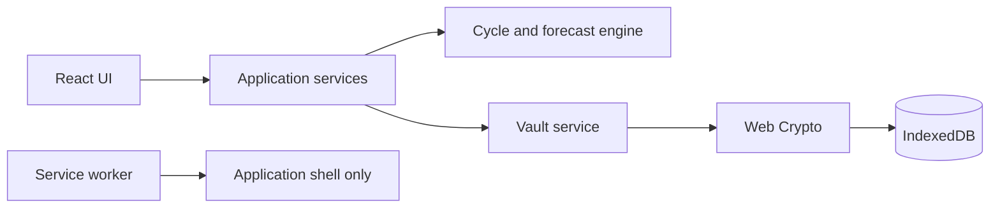

# Menstrual Pattern Tracker

> Working repository name: `perfectdays`. The final public product name is still open.

A private, mobile-first menstrual journal that records bleeding and helps its user notice her own recurring wellbeing patterns. The product uses red, orange, and green calendar markers, but treats them as personal context rather than biological verdicts or judgments about competence.

**Status:** Phase 0 foundation implemented. The repository contains the typed React application shell, light/dark themes, English/German localization, domain foundations, security boundaries, and automated test setup; menstrual logging and PIN encryption are not implemented yet.

## Product goal

The app should make it easy to:

- record menstruation and spotting;
- estimate the next period without pretending the estimate is certain;
- add a configurable pre-period check-in window;
- record daily confidence and energy, with the MVP's green marker tied specifically to recorded confidence;
- understand patterns retrospectively over several cycles; and
- keep this sensitive information private and under the user's control.

The primary user is the person who menstruates. She owns the data and decides whether it is ever exported or shared. Partner monitoring, surveillance, or automatic partner access is outside the MVP.

The product promise is **“patterns, not prescriptions.”** It must not tell someone that she is incapable of making decisions, likely to cause conflict, or guaranteed to feel a certain way because of a predicted cycle phase.

## Product principles

1. **Personal before universal.** Orange and green reflect the user's settings and observations, not assumptions about every woman.
2. **Recorded before predicted.** Logged information is visually and semantically distinct from forecasts.
3. **Uncertainty is visible.** Forecasts show a range, confidence, and the amount of history used.
4. **Colors are context, not grades.** Red is not “bad,” green is not “good,” and neutral days are valid.
5. **Privacy is architecture.** The MVP has no account, backend, advertising, analytics, or third-party tracking.
6. **The user remains in charge.** Suggestions invite a check-in; they do not direct behavior.
7. **Accessibility is part of the MVP.** Color is never the only way information is communicated.
8. **Every message is translatable.** User-visible copy, accessible names, errors, empty states, confirmations, and notification text come from keyed per-language resources rather than being embedded in components.

## Calendar markers

Markers may overlap. For example, a person can be menstruating and also report high confidence.

| Marker | Meaning | MVP presentation |
| --- | --- | --- |
| **Recorded red** | Bleeding explicitly logged by the user | Solid red background plus droplet icon and text label |
| **Predicted red** | Estimated future menstruation | Pale or patterned red, clearly labeled “predicted” |
| **Orange** | Optional pre-period check-in window | Orange border or badge, never a warning about competence |
| **Green** | A day with an explicitly logged high-confidence score | Green badge or accent; retrospective only in the MVP |
| **Neutral** | Nothing recorded or insufficient evidence | Normal calendar styling |
| **Spotting** | Spotting that does not start a cycle by itself | Separate dot/icon rather than recorded-red styling |

Example language:

- “Possible pre-period check-in window. How do you feel today?”
- “You recorded higher confidence on this day.”
- “Your next period may start August 12–15. Confidence: medium.”
- “Based on four completed cycles.”

Language to avoid:

- “Do not make decisions today.”
- “Conflict is likely.”
- “This is your best phase.”
- “Your hormones are making you irrational.”

## MVP scope

### 1. Onboarding

- Explain local storage, PIN limitations, prediction uncertainty, and the product's non-medical scope in plain language.
- Allow entry of known previous episode start/end dates; four starts provide three completed cycle lengths, while completed end dates provide duration history.
- Ask for usual cycle length and typical bleeding duration as optional fallbacks. These values never override recorded history.
- Enable or disable the orange window and choose its length. Default: five days; allowed range: 1–14 days.
- Use confidence as the initial green metric.
- Offer an optional six-digit PIN and explain that, when enabled, forgetting it requires erasing the inaccessible encrypted local data.
- Choose **System**, **Light**, or **Dark** appearance. Default: System.
- Choose **Device language**, **English**, or **Deutsch**. Default: Device language; unsupported device languages fall back to English.

### 2. Calendar and home

- Mobile-first monthly calendar with today clearly identified.
- Recorded bleeding, predicted bleeding, spotting, orange, green, and neutral states.
- Recorded and predicted states must remain unmistakably different.
- A legend that explains every color, icon, and pattern.
- A compact next-period estimate showing its range, confidence, and number of completed cycles used.
- Selecting a date opens its day-detail editor.

### 3. Today and day detail

- Start, continue, end, edit, or remove menstruation.
- Record flow as `none`, `spotting`, `light`, `medium`, or `heavy`.
- Record confidence, tension, energy, and pain on consistent 1–5 scales.
- Add an optional private note.
- Save a useful minimum entry in no more than two taps.
- Recalculate forecasts immediately after relevant history changes.

### 4. Insights

- Recent cycle lengths and bleeding durations.
- Next-period range and confidence.
- Number of completed cycles behind an estimate.
- Retrospective high-confidence days.
- Neutral, observational wording with sample sizes and counterexamples where useful.
- No causal claims and no universal phase advice.

### 5. Settings and privacy

- System, light, and dark theme selection.
- Device-language, English, and German language selection.
- Enable, disable, or change the local PIN.
- Auto-lock timing: immediately, 1 minute, 5 minutes, or 15 minutes after backgrounding. Default: 1 minute.
- Configure or disable the orange window.
- Pause/reset forecasting without deleting recorded history.
- Export an encrypted backup and restore it later when PIN protection is enabled; restoring requires the PIN used when that backup was created.
- Optional plaintext export only behind a prominent sensitivity warning.
- Erase all application-controlled data after explicit confirmation.
- Explain what is stored, what is not collected, and the limitations of browser storage.
- Optional generic reminder copy such as “Daily check-in?” if notifications are included.

## Forecasting rules

Forecasting must remain deterministic, explainable, and separately testable from the UI.

### Cycle definitions

- Calendar observations use local date-only values in `YYYY-MM-DD` form.
- A menstrual episode has an explicit, user-editable start date and an inclusive end date. An episode without an end date is active.
- The episode start is authoritative for cycle calculation and must be a non-spotting flow day.
- A cycle length is the number of calendar days between successive episode starts.
- Spotting alone never creates an episode or starts a new cycle.
- Episodes cannot overlap. Starting a new episode while another is active requires ending or correcting the active episode first.
- Missing or `none` flow inside an episode does not silently create a new cycle; splitting or merging episodes is an explicit correction.
- Timestamps may be used for metadata such as `updatedAt`, but never to determine which calendar day was recorded.

### Initial next-period algorithm

1. Take the latest 3–6 completed cycle lengths when available. A cycle length is complete as soon as the next episode start is known, even if that newer episode is still active.
2. Use their median as the central estimated cycle length. For an even number of integer samples, average the two middle values and round `.5` upward to the next whole calendar day.
3. Add that length to the latest recorded period start for the central estimated start date.
4. Estimate bleeding duration separately using the same median rule on recent episodes with an end date. Use the optional usual duration only when no completed duration exists; otherwise leave predicted duration unknown.
5. Show an estimated range rather than presenting the central date as certain.

Initial uncertainty behavior:

- **No completed cycle:** do not forecast unless the user supplied a usual cycle length. A fallback uses a ±4-day window and is labeled “rough.”
- **One or two completed cycles:** label the result “rough” and show a window of at least ±3 days.
- **Three to six completed cycles:** use the shortest and longest recent lengths to produce the initial earliest/latest bounds; the median remains the central estimate but is not assumed to be the midpoint. Apply a minimum ±2-day uncertainty floor around the central estimate even when the recorded cycles were identical, until pilot calibration supports a different floor.
- **Highly variable history:** a recent length span greater than 10 days is “low” confidence. Show the textual range but suppress predicted-red and orange calendar coloring instead of creating false precision.
- **Late period:** do not silently move an exact forecast forward every day. Mark the estimate as uncertain and wait for a new record or user correction.

For one or two completed lengths, the earliest/latest bounds are the union of the observed bounds and `centralStart ± 3 days`. For three to six, they are the union of the shortest/longest-derived bounds and `centralStart ± 2 days`.

The precise range calibration should be backtested during the pilot and may be refined without changing the principles above.

Initial confidence labels:

- **Rough:** a user-supplied fallback or fewer than three completed cycle lengths.
- **Medium:** at least four completed cycle lengths and a recent length span of four days or less.
- **Low:** every other usable history, including any recent span greater than four days.

### Red forecast

- Recorded red always overrides a forecast.
- The central predicted episode is visually patterned or pale and explicitly announced as predicted. If predicted duration is unknown, only the central start receives predicted-red styling.
- Possible start dates receive an outline/range indicator rather than full predicted-red styling, preventing the entire uncertainty window from looking like predicted bleeding.
- A length span greater than 10 days suppresses both predicted-red styles; the textual range remains available.
- Editing or deleting period history recalculates the prediction immediately.

### Orange window

- Enabled by default with `X = 5`, configurable from 1–14 days or disabled entirely.
- Covers the `X` days immediately before the central estimated period start.
- Is labeled as a possible check-in window, not PMS diagnosis or behavioral advice.
- Is withheld when no usable period forecast exists.
- If actual bleeding begins early, the recorded red state supersedes the orange forecast.

### Green days

- In the MVP, green is retrospective and comes from the user's own check-in.
- A confidence value of 4 or 5 qualifies for a green marker.
- Menstruation and green may coexist; red can be the background while green appears as a badge.
- Future green prediction is deferred until there are at least three completed cycles with sufficient daily check-ins and evidence of a recurring personal pattern.

## Logical data model

The domain model is independent from its encrypted physical representation.

```ts
type LocalDate = string; // YYYY-MM-DD
type Rating = 1 | 2 | 3 | 4 | 5;
type Flow = "none" | "spotting" | "light" | "medium" | "heavy";

type PeriodEpisode = {
  id: string;
  startDate: LocalDate;
  endDate?: LocalDate; // inclusive; absent while the episode is active
  createdAt: string;
  updatedAt: string;
};

type DailyLog = {
  date: LocalDate;
  flow?: Flow;
  episodeId?: string;
  confidence?: Rating;
  tension?: Rating;
  energy?: Rating;
  pain?: Rating;
  note?: string;
  updatedAt: string; // metadata timestamp, not calendar-day logic
};

type ThemePreference = "system" | "light" | "dark";
type SupportedLanguage = "en" | "de";
type LanguagePreference = "system" | SupportedLanguage;
type AutoLockDelay = "immediate" | "1-minute" | "5-minutes" | "15-minutes";

type UserSettings = {
  theme: ThemePreference;
  language: LanguagePreference;
  orangeEnabled: boolean;
  orangeDays: number;
  typicalCycleLength?: number;
  typicalBleedDuration?: number;
  forecastingPaused: boolean;
  pinEnabled: boolean;
  autoLockDelay: AutoLockDelay;
};

type VaultPayload = {
  schemaVersion: number;
  episodes: PeriodEpisode[];
  logs: DailyLog[];
  settings: Omit<UserSettings, "theme" | "language" | "pinEnabled">;
  createdAt: string;
  updatedAt: string;
};

type Forecast = {
  centralStart: LocalDate;
  earliestStart: LocalDate;
  latestStart: LocalDate;
  predictedDuration?: number;
  completedCyclesUsed: number;
  confidence: "rough" | "low" | "medium";
};
```

Cycles, marker combinations, insights, and forecasts are derived. They are not persisted as authoritative health observations.

`pinEnabled` is derived from the active storage representation rather than duplicated inside the encrypted payload. This avoids contradictory security state. Theme and language are non-health UI preferences intentionally stored outside the health-data vault so the future lock screen can use them before unlock.

Episode invariants:

- There is at most one `DailyLog` per local date.
- `startDate <= endDate` when an end exists.
- Episodes cannot overlap, and at most one episode may be active.
- Every linked log date falls within its episode's inclusive bounds.
- A log with `light`, `medium`, or `heavy` flow must reference the episode covering that date.
- A linked log with omitted `flow` means a recorded period day whose intensity was not specified; it receives recorded-red styling.
- A date inside an episode with no linked log is not automatically presented as a recorded bleeding day.
- A linked `none` or `spotting` value does not receive recorded-red styling and does not split the episode automatically.
- A start-date log must exist and cannot explicitly have `none` or `spotting` flow.
- A spotting log does not require an episode and never creates one.
- An episode is a user-controlled boundary. A linked `none`/spotting log or an entirely unlogged date within its range does not split it automatically.
- Ending an episode records an inclusive `endDate`. Editing, splitting, merging, or deleting an episode revalidates its linked daily logs before forecasts are recalculated.
- Completed bleeding duration is `endDate - startDate + 1` calendar days; daily flow intensity does not change that episode-boundary calculation.

Action mapping:

- **Start period** creates an episode plus its start-date log.
- **Continue period** creates or updates a log linked to the active episode.
- **End period** sets the active episode's inclusive end date.
- Historical range entry creates the episode and linked period-day logs together.

## PIN app lock and encrypted vault

The PIN is a local app lock, not an online login. There is no username, email address, server session, or remote recovery.

### User experience

- PIN setup is optional but prominently recommended during onboarding.
- Use a six-digit PIN entered twice for confirmation.
- Require the PIN when the PWA is opened and after the configured background timeout.
- Apply increasing delays after repeated incorrect attempts.
- Allow PIN changes only while the current vault is unlocked.
- “Forgot PIN” explains that recovery is impossible and offers destructive local reset.
- Export, restore, PIN changes, and deletion require an unlocked vault.
- Use a neutral lock screen that does not reveal menstrual information.

### PIN-disabled mode and transitions

PIN setup remains optional for the MVP, so the storage behavior must be explicit:

- With PIN protection **enabled**, health data uses the encrypted-vault design below.
- With PIN protection **disabled**, health data is stored as ordinary local IndexedDB data. The UI must say clearly that there is no app-level encryption or access gate in this mode.
- Do not encrypt data with a key stored beside it and present that as meaningful PIN-free protection.
- Enabling a PIN migrates the unprotected payload to the encrypted vault. Disabling it requires the current PIN, a prominent warning, and migration back to unprotected local storage.
- A migration writes and verifies the new representation before switching the active-storage pointer and deleting the old representation. If verification fails, the original remains active.
- Acceptance statements about persisted plaintext and keys apply only while PIN protection is enabled.

### Encryption design

Use the browser's Web Crypto API rather than custom cryptography:

1. Generate a random per-vault salt and record the key-derivation parameters.
2. Derive a key-encryption key from the PIN with PBKDF2-SHA-256. Calibrate the work factor on supported devices rather than embedding an unjustified permanent value.
3. Generate a random 256-bit data-encryption key.
4. Protect the data-encryption key with the PIN-derived key using authenticated encryption.
5. Encrypt the serialized `VaultPayload` with AES-GCM and a fresh random IV for every encryption.
6. Persist only the salt, derivation parameters, wrapped key, IVs, authenticated ciphertext, and non-sensitive preferences such as theme.
7. Never store the PIN, plaintext health data, or an unwrapped data key.
8. On lock, discard in-memory plaintext and key references as far as the JavaScript runtime permits.

Using a separate random data key allows a PIN change to re-protect the data key without rewriting the complete history.

### Honest limitations

- A six-digit PIN has limited entropy. Key derivation and UI throttling slow guessing but cannot make it equivalent to a long passphrase.
- UI attempt limits cannot stop an attacker who has copied the encrypted browser database and performs offline guesses.
- Encryption does not protect data while the vault is unlocked, against malicious browser extensions, or on a compromised device.
- JavaScript cannot guarantee immediate memory zeroization.
- App-switcher preview concealment is best-effort in a PWA and varies by browser and operating system.
- Clearing browser/site data can permanently erase the vault; encrypted export is therefore important.

A longer passphrase and platform passkey/biometric unlock may be added later, but the product must not overstate what the MVP PIN protects.

### Backup behavior

- An encrypted backup is available when PIN protection is enabled. It contains the encrypted payload and the parameters needed to derive its wrapping key, but never the PIN.
- Restoring that backup requires the PIN that was active when the backup was created. Changing the live app PIN does not change old backup files.
- After restoring, the user may change the PIN normally.
- With PIN protection disabled, the app asks the user to enable a PIN before creating an encrypted backup. A plaintext export remains possible only after an explicit sensitivity warning.

## Light and dark themes

- Provide `system`, `light`, and `dark` settings from the first UI implementation.
- Use CSS custom properties/design tokens rather than duplicating component styles.
- Resolve the system preference using `prefers-color-scheme` and respond to changes while the app is open.
- Persist the theme outside the encrypted health payload so the lock screen can use the correct theme.
- Apply the saved theme before React renders to avoid a light/dark startup flash.
- Update PWA/browser theme colors for both modes.
- Test every marker and interaction state in both themes.
- Meet WCAG 2.2 AA contrast requirements without changing the meaning of recorded or predicted markers.

## Architecture



Foundation stack:

- React and TypeScript
- Vite
- i18next and react-i18next with locally bundled, typed resources
- CSS Modules with shared design tokens
- Vitest and React Testing Library
- Playwright for end-to-end, mobile, offline, and accessibility flows
- ESLint, Prettier, and strict TypeScript settings

Secure-core additions, intentionally deferred until Phase 1:

- IndexedDB through Dexie, behind the existing repository/vault interface
- Web Crypto implementation behind the existing cryptography interface
- Zod validation and explicit migrations at the persistence boundary

A Vite-compatible PWA plugin remains deferred until the core application flow works. Keeping unused production dependencies out of the initial scaffold reduces supply-chain surface and prevents placeholder storage or cryptography from being mistaken for a security feature.

Architecture constraints:

- No backend or remote account in the MVP.
- No network request may contain health data.
- No third-party analytics, advertising, hosted fonts, or tracking SDKs.
- The service worker caches only the application shell and static assets, never decrypted health data.
- Forecast logic remains pure and independent from React, IndexedDB, and encryption.
- Stored data has an explicit schema version and tested migration path.
- Production deployments use HTTPS and a restrictive Content Security Policy.
- English is the canonical typed translation schema. Every supported catalog must have the same keys and interpolation placeholders.
- Translation resources are bundled with the application; no runtime translation backend, detector plugin, or translation-service request is allowed.
- Domain models, application services, and persistence use stable locale-neutral codes. Translation happens only at the presentation/composition boundary.
- Whole messages are translated. Components do not concatenate translated sentence fragments; interpolation and plural rules carry dynamic values.
- Health values must never be used as translation keys or copied into translation resources.

### Repository structure

```text
e2e/                         Playwright browser and accessibility smoke tests
src/
  app/                       Composition and cross-cutting React providers
    i18n/                    Language preference context and document synchronization
  application/ports/         Interfaces owned by application policy
  domain/                    Pure models and deterministic date logic
  features/                  UI grouped by user workflow
  i18n/                      Configuration, typed resources, locale resolution, and tests
    locales/en.ts            Canonical English message catalog
    locales/de.ts            German message catalog
  infrastructure/            Browser-specific implementations of application ports
  shared/styles/             Global styles and light/dark design tokens
  test/                      Shared Vitest and Testing Library setup
index.html                   App entry and pre-render theme initialization
eslint.config.mjs            Typed linting and dependency-boundary rules
playwright.config.ts         Desktop and mobile browser projects
vite.config.ts               Production and development bundling
vitest.config.ts             Unit and component test configuration
```

The dependency direction is:

```text
features -> application -> domain
infrastructure -> application + domain
app -> composition of all layers
```

- `domain` stays independent of React, browser APIs, persistence, and encryption.
- `application` owns interfaces; browser infrastructure implements them.
- Features may call application services but may not import infrastructure directly.
- Only the composition layer wires concrete adapters into the UI.
- Components select typed message keys; locale resources do not leak into the domain or persistence layers.
- ESLint enforces the most important import boundaries and rejects `console` calls in `src`, reducing the risk of sensitive records appearing in logs.
- ESLint rejects literal user-visible JSX text, while tests enforce translation key and interpolation-placeholder parity.
- Directories are added when they contain a real implementation or contract; empty placeholder layers and generic `utils` folders are avoided.

### Implemented foundation

- A responsive, accessible React shell rendered in `StrictMode`.
- System, light, and dark theme selection with local persistence.
- Theme application before React renders, preventing an explicit saved theme from flashing incorrectly at startup.
- Device-language, English, and German selection with local persistence and English fallback.
- Typed English and German message catalogs stored in separate per-language files with no runtime translation network request.
- Immediate copy updates plus synchronized document `lang`, `dir`, title, and description metadata when language changes.
- Device locale resolution by supported base tag, including values such as `de-DE` and `de-AT`, and live re-resolution after a browser language change while Device language is selected.
- CSS design tokens for both themes, reduced-motion handling, visible keyboard focus, and non-color marker accents.
- A validated local-date type and timezone-independent date arithmetic with leap-year and boundary tests.
- Explicit storage and cryptography ports for staged, verifiable PIN migrations without exposing `CryptoKey` objects to React.
- Strict TypeScript, type-aware ESLint, Prettier, Vitest, Testing Library, Playwright, and an automated axe accessibility smoke test.

Not implemented yet: IndexedDB persistence, encryption, PIN screens, cycle forecasting, logging, calendar UI, service worker, or installability. The interfaces in the scaffold are constraints for those features, not claims that they already protect data.

## Privacy and data lifecycle

- Collect no real name, email, date of birth, contacts, precise location, advertising identifier, or unrelated device data.
- Keep health data on the device by default.
- Keep sensitive values out of URLs, console logs, error messages, crash reports, notification payloads, and cached responses.
- Persist only the non-sensitive language preference under `perfect-days:language`; it contains `system`, `en`, or `de`, never health data.
- Keep every language catalog in the application bundle. Localization must not send copy, identifiers, or health data to an external service.
- Make encrypted export the safe default.
- Clearly warn that plaintext JSON or CSV exports can be read by anyone who obtains the file.
- Make correction and deletion available from the UI.
- “Erase everything” removes the encrypted vault, wrapped key, salt, theme/language preferences, and every other application-controlled item that could contain personal data. A static application shell and its translation catalogs may remain cached because they contain no user data.
- Use generic notifications and never show period status on the lock screen without explicit opt-in.
- Do not claim that local-only storage or a PIN makes the application invulnerable.

Menstrual and mood records are sensitive health information. An EU launch requires GDPR legal-basis and privacy-by-design review; a public US launch should assess the FTC Health Breach Notification Rule even if HIPAA does not apply. Legal and data-protection review is required before public beta, not before a private prototype.

## Clinical and safety guardrails

This is a journal and reflection tool. It is not:

- contraception or a “safe day” method;
- an ovulation or fertility predictor;
- a pregnancy test;
- a PMS or PMDD diagnosis;
- medical treatment; or
- evidence that decision-making ability changes with cycle phase.

Premenstrual symptoms vary between people and between cycles. ACOG recommends prospective daily symptom records over multiple cycles when evaluating a possible PMS pattern. That supports personalized observations, not a universal orange window.

Before public beta, clinical copy should be reviewed and the app should gently direct users toward professional help for persistent unusual bleeding, very heavy or prolonged bleeding, bleeding between periods, severe symptoms, or pain that disrupts normal life. Urgent and mental-health help must be localized to the user's country rather than hard-coded to one emergency number.

The interface must never diagnose from a single entry or turn safety information into alarming automated conclusions.

## Accessibility and localization

- The MVP ships complete English (`en`) and German (`de`) catalogs. English is the fallback language.
- **Device language** is the default. The app checks browser language tags in priority order, resolves supported base tags such as `de-DE` to `de`, and falls back to English when none is supported.
- Every visible message and every user-facing accessible name, description, validation error, empty state, confirmation, and notification must use a typed key from a per-language file.
- The document `lang` and `dir` attributes, page title, and description metadata update whenever the resolved language changes.
- The language selector uses a native labeled control and language endonyms (`English`, `Deutsch`), not flags.
- Translation keys represent complete messages. Use interpolation, context, and locale-aware plural rules rather than concatenating fragments.
- Format dates, month and weekday names, numbers, and quantities with the resolved language at the presentation boundary. Persisted `LocalDate` values and enum codes remain locale-neutral.
- English and German are left-to-right, while layout continues to use logical CSS properties for future right-to-left locales.
- Catalog tests require identical keys, non-empty values, and matching interpolation placeholders. Component and browser tests exercise visible and accessible behavior in both languages.
- Meet WCAG 2.2 AA contrast in light and dark themes.
- Never communicate a state with color alone; use text, icons, patterns, and screen-reader descriptions.
- Example announcement: “August 12, predicted period, medium confidence.”
- Support keyboard, switch, and screen-reader operation.
- Use touch targets of at least 44 × 44 CSS pixels.
- Support browser zoom and large text without clipping or hiding controls.
- Respect reduced-motion preferences.
- Use locale-aware month names, date formatting, and first day of the week while storing ISO local dates internally.
- Keep language simple and avoid gender assumptions in generic UI copy, while allowing the product to speak naturally to women who describe themselves that way.
- Review clinical and safety meaning in every translation; syntactic key parity does not replace human language review.

Calendar-specific behavior:

- Represent the month as a semantic grid/table with weekday headers and a complete accessible name for every date cell.
- Include recorded/predicted status, marker type, and confidence in the date control's accessible description.
- Use one predictable keyboard-entry point for the grid; arrow keys move by day/week and Page Up/Page Down move by month without trapping focus.
- Move focus into the day-detail dialog when it opens and return focus to the originating date when it closes.
- Preserve today, selected-day, focus, recorded, and predicted distinctions in forced-colors/high-contrast mode.
- Do not make pointer hover the only way to reveal a forecast explanation.

Initial browser targets for the prototype are the latest two major versions of Chrome/Edge on desktop and Android, and Safari on macOS and iOS. Firefox should receive the complete web experience, while installability may vary by platform. The supported matrix must be re-confirmed before public beta.

## Non-goals for the MVP

- Ovulation, fertile-window, pregnancy, or contraceptive predictions
- PMS/PMDD diagnosis or medication recommendations
- Automatic advice to cancel meetings, avoid people, or postpone decisions
- Future green-day predictions
- Machine-learned orange windows
- Cloud accounts or synchronization
- Partner accounts, partner newsletters, or automatic sharing
- Social features, advertising, or data monetization
- Wearable and health-platform integrations
- Clinician portals
- Native App Store or Play Store packaging
- Biometrics or passkeys

## Implementation roadmap

### Phase 0 — Foundation (complete)

- [x] Finalize this README as the initial product specification.
- [x] Initialize Git and scaffold React, TypeScript, and Vite without losing this document.
- [x] Configure strict TypeScript, linting, formatting, unit tests, and production builds.
- [x] Establish theme tokens and local-date utilities before feature components.
- [x] Add typed, locally bundled English/German catalogs, device-language resolution, selection, persistence, and metadata synchronization.

### Phase 1 — Secure local core

- Implement the versioned logical data model.
- Implement the encrypted vault, PIN setup, unlock, auto-lock, PIN change, and destructive reset.
- Test cryptographic round trips, wrong-PIN behavior, corruption, locking, and schema migration.

### Phase 2 — First vertical slice

- Onboarding with historical starts, orange setting, theme, language, and PIN.
- Calendar with recorded red days and accessible legends.
- Day editor for flow, spotting, confidence, tension, energy, pain, and notes.
- Green badges for recorded confidence values of 4–5.
- Minimal deterministic next-period calculation, predicted-red styling, and orange-window behavior.
- Persistence across reloads and immediate recalculation after edits.

### Phase 3 — Forecast refinement and insights

- Refine pure cycle grouping, duration, uncertainty, and confidence functions around the tested Phase 2 baseline.
- Add complete explanations for predicted red, possible-start ranges, and orange states.
- Insights for recent cycle length, duration, confidence, and retrospective green days.
- Backtesting fixtures for regular, irregular, late, missing, and edited histories.

### Phase 4 — PWA and hardening

- Offline application shell and installability.
- Encrypted export/restore and warned plaintext export.
- Theme integration with browser/PWA chrome.
- Accessibility, responsive-layout, keyboard, and screen-reader review.
- Security headers, network-request audit, and sensitive-data leakage checks.
- Full export, restore, and erasure verification.

### Phase 5 — Pilot and public-beta readiness

- Pilot privately over multiple real cycles.
- Test terminology and forecast comprehension with menstruating users.
- Obtain clinical-language, privacy/legal, accessibility, and security review.
- Calibrate forecast ranges from held-out histories.
- Choose and clear the final product name.

## Acceptance criteria

### Functional

- [ ] A user can create, edit, and delete periods and daily check-ins.
- [ ] Spotting does not start a period automatically.
- [ ] A useful bleeding entry takes at most two taps.
- [ ] Forecasts update immediately after relevant edits.
- [ ] Forecasts show a range, confidence, and number of cycles used.
- [ ] Green is based only on an explicit qualifying check-in in the MVP.
- [ ] Red, orange, and green can coexist without hiding recorded facts.
- [ ] Data survives reload while the browser retains the origin's storage and remains available offline after installation under the same condition.
- [ ] PIN-enabled encrypted backup/restore and application-level personal-data erasure work as documented.

### Theme, localization, and accessibility

- [ ] System, light, and dark modes work on the lock screen and every application screen.
- [ ] The correct theme appears before first paint without a visible flash.
- [x] Device-language, English, and German selection updates the current application shell and survives reload.
- [x] Supported device base tags resolve predictably, with English as the tested fallback.
- [x] Language changes update current visible/accessibility copy, document `lang`/`dir`, title, and description metadata without losing selector focus.
- [x] English and German catalogs have exact key and interpolation-placeholder parity.
- [ ] The future lock screen and every future feature expose no hard-coded user-visible copy.
- [ ] Calendar dates, months, weekdays, numbers, and plural messages follow the resolved language while persisted domain values remain locale-neutral.
- [ ] Every marker is understandable without color.
- [ ] Both themes meet WCAG 2.2 AA contrast.
- [ ] Core flows work at 320 CSS pixels wide, with keyboard, large text, and a screen reader.
- [ ] Calendar arrow-key navigation, month navigation, dialog focus return, and forced-colors states work as documented.

### PIN and security

- [ ] When PIN protection is enabled, the correct PIN unlocks the vault after a reload.
- [ ] A failed UI unlock renders no health records.
- [ ] Auto-lock works through supported page-lifecycle events after the configured background timeout and through the manual lock action.
- [ ] When PIN protection is enabled, no PIN, plaintext record, or unwrapped data key is persisted.
- [ ] PIN enable/disable migrations verify the new representation before removing the previous one and recover safely from an interrupted migration.
- [ ] Every AES-GCM encryption uses a fresh IV.
- [ ] Corrupt or tampered ciphertext fails closed without destroying the original automatically.
- [ ] Reset removes the encrypted vault, key material, preferences, and every application-controlled copy of personal data after explicit confirmation.
- [ ] No health data appears in logs, URLs, notifications, service-worker caches, or network requests.

### Date and forecast correctness

- [ ] A local date never shifts after travel, timezone changes, or daylight-saving transitions.
- [ ] Tests cover insufficient, regular, irregular, short, long, and missing histories.
- [ ] Tests cover month/year boundaries, leap years, editing, deletion, spotting, and overlapping markers.
- [ ] Actual bleeding overrides conflicting forecasts.
- [ ] A late period does not cause the app to invent a moving exact date.

### Build quality

- [ ] Lint, formatting checks, strict type-checking, unit tests, production build, and Playwright smoke tests pass.
- [ ] Persisted schema migrations are tested.
- [x] Translation catalog parity, locale resolution, storage failure, component switching, and localized browser smoke tests are automated.
- [ ] The application works with the network disabled after installation while its origin storage and application-shell cache remain available.
- [ ] Dependencies and production assets introduce no advertising or tracking behavior.

## Validation targets

- At least 90% of usability-test participants should distinguish recorded from predicted days without coaching.
- Users should understand that orange is a check-in suggestion, not a judgment about competence.
- Backtesting should report median start-date error and empirical coverage of forecast ranges, segmented by cycle variability.
- An intended 80% prediction interval should cover approximately 80% of held-out starts before it is described that way in the UI.
- Deletion should leave no application-controlled copy recoverable through normal product behavior.

## Current development environment

Verified on August 7, 2026:

- Windows and PowerShell
- Node.js `v24.19.0`
- npm `11.17.0`
- Git `2.55.0.windows.3`
- Git repository on `main`, tracking `origin/main`
- PowerShell blocks the `npm.ps1` shim under the current execution policy; use `npm.cmd` and `npx.cmd` rather than changing machine-wide policy merely for this project.

### Local setup

From PowerShell in the repository root:

```powershell
npm.cmd install
npx.cmd playwright install
npm.cmd run dev
```

Vite prints the local development URL. Stop it with `Ctrl+C`.

Quality commands:

| Command | Purpose |
| --- | --- |
| `npm.cmd run format:check` | Check formatting without changing files |
| `npm.cmd run lint` | Run type-aware linting and architecture rules |
| `npm.cmd run typecheck` | Run strict TypeScript checks without emitting files |
| `npm.cmd test` | Run Vitest unit and component tests once |
| `npm.cmd run test:watch` | Run Vitest interactively while developing |
| `npm.cmd run test:e2e` | Run Playwright across configured desktop and mobile projects |
| `npm.cmd run build` | Type-check and create the production bundle in `dist/` |
| `npm.cmd run verify` | Run formatting, linting, unit tests, and production build |
| `npm.cmd run ci` | Run the complete verification and browser-test suite |

The Playwright browser download is machine-local and is not stored in this repository. CI on Linux should install its browsers and operating-system dependencies with `npx playwright install --with-deps` before running `npm run ci`. Commit `package-lock.json`; use `npm ci` for reproducible CI and clean-machine installs.

`npm.cmd test` includes catalog key/placeholder parity and language-resolution tests. Add a message to `src/i18n/locales/en.ts` first, then add the matching key and placeholders to every other locale; TypeScript and the test suite reject drift.

## Decisions assumed unless changed

- Mobile-first installable PWA
- Local-only, offline, single-user MVP
- Adult self-tracking use case
- English and German MVP catalogs; Device language by default; English fallback
- Final product name deferred
- System theme by default
- Optional six-digit PIN
- One-minute default auto-lock after backgrounding
- Five-day default orange window
- Confidence as the initial green metric
- Retrospective green markers only
- No backend, partner access, fertility features, or analytics

These defaults are sufficient to begin implementation. Final naming, visual identity, supported launch jurisdictions, native packaging, and advanced personalization do not block the prototype.

## Naming status

`Ovault` and `Perfect Days` have both been explored, but neither should be treated as legally or commercially cleared:

- **Ovault** is short and suggests privacy, but `ova` over-signals ovulation, fertility, or egg storage. An exact-name [OVault authenticator](https://apps.apple.com/us/app/ovault/id6736616639) and an unrelated [Ovault data platform](https://ovault.io/) already exist.
- **Perfect Days** is warmer, but can imply that red, orange, or neutral days are imperfect. It also competes with the well-known [Wim Wenders film](https://www.perfectdays-movie.jp/en/) and an existing [Perfect Days itinerary app](https://perfectdays.in/).

Current creative directions include `DayHue`, `OwnRhythm`, `CycleContext`, `Signal Days`, and `Days Within`; none has received trademark, domain, localization, or app-store clearance.

The final name should communicate privacy, agency, and personal patterns without implying that some days make a person less competent or “imperfect.” Branding should not delay the technical prototype.

## References

Product and clinical framing:

- [ACOG: Premenstrual Syndrome](https://www.acog.org/womens-health/faqs/Premenstrual-Syndrome)
- [ACOG: Abnormal Uterine Bleeding](https://www.acog.org/womens-health/faqs/abnormal-uterine-bleeding)
- [US Office on Women's Health: Your Menstrual Cycle](https://womenshealth.gov/menstrual-cycle/your-menstrual-cycle)
- [PLOS ONE: Menstrual cycle effects on cognitive performance — a meta-analysis](https://journals.plos.org/plosone/article?id=10.1371/journal.pone.0318576)
- [PLOS ONE: Feeling of self-worth in healthy premenopausal women](https://journals.plos.org/plosone/article?id=10.1371/journal.pone.0327539)

Privacy and data protection:

- [European Commission: Data protection by design and by default](https://commission.europa.eu/law/law-topic/data-protection/information-business-and-organisations/obligations/what-does-data-protection-design-and-default-mean_en)
- [FTC: Complying with the Health Breach Notification Rule](https://www.ftc.gov/business-guidance/resources/complying-ftcs-health-breach-notification-rule-0)

Technical foundations:

- [Vite documentation](https://vite.dev/guide/)
- [react-i18next documentation](https://react.i18next.com/latest)
- [i18next TypeScript documentation](https://www.i18next.com/overview/typescript)
- [Dexie React tutorial](https://dexie.org/docs/Tutorial/React)
- [Playwright documentation](https://playwright.dev/docs/intro)

---

This README is the current source of truth for the prototype. When implementation changes a product rule, security property, or scope decision, update this document in the same change.
